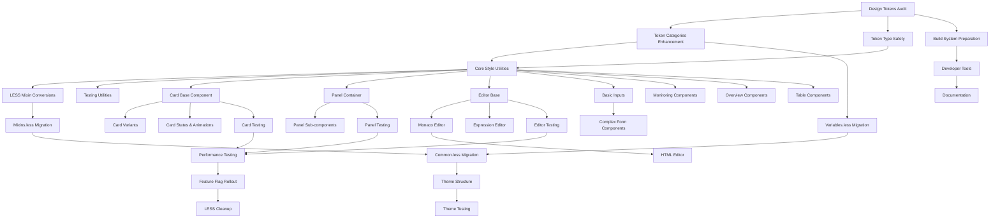

# LESS to makeStyles Migration Dependency Graph

## Overview
This document visualizes the dependencies between migration tasks, helping identify which tasks can be done in parallel and which must be done sequentially.

## Dependency Flow Diagram

## Critical Path Analysis

### Sequential Dependencies (Must be done in order)

#### Path 1: Token Foundation
1. Design Tokens Audit (2 days)
2. Token Categories Enhancement (3 days)
3. Core Style Utilities (3 days)
4. Component Migration Start

**Total blocking time: 8 days before components can start**

#### Path 2: Shared Resources
1. Variables.less Migration (2 days)
2. Common.less Migration (2 days)
3. Theme Structure (3 days)
4. Theme Testing (2 days)

**Total time: 9 days**

### Parallel Execution Opportunities

#### Track A: Infrastructure (Can start Day 1)
- Build System Preparation
- Developer Tools
- Documentation
- Testing Utilities

#### Track B: Independent Components (Can start after Day 8)
**Team Member 1:**
- Card Components (10 subtasks)
- Card Variants (5 subtasks)

**Team Member 2:**
- Panel Components (7 subtasks)
- Panel Sub-components (5 subtasks)

**Team Member 3:**
- Editor Base Components (5 subtasks)
- Monaco/Expression Editors (8 subtasks)

**Team Member 4:**
- Monitoring Components
- [x] Overview Components - ✅ COMPLETED (VS Code overview.less → overviewStyles.ts)
- [x] Panel Components - ✅ COMPLETED (NodeSearchPanel with Tabster focus management)
- Table Components

#### Track C: VS Code Application Components (SIGNIFICANT PROGRESS)
**Recently Completed:**
- [x] Export Components (export.less → exportStyles.ts) - ✅ COMPLETED (PR #7588/#7797)
- [x] Overview App (overview.less → overviewStyles.ts) - ✅ COMPLETED (PR #7588)
- [x] ReviewList Component (styles.less → reviewListStyles.ts) - ✅ COMPLETED (PR #7820)
- [x] SVG Icon Migration (3 SVG files → Fluent UI icons) - ✅ COMPLETED (PR #7820)

## Resource Allocation Strategy

### Week 1-2: Foundation Sprint
**4 developers needed:**
- Developer 1: Design Tokens & Type Safety
- Developer 2: Build System & Developer Tools
- Developer 3: Style Utilities & Mixins
- Developer 4: Documentation & Testing Setup

### Week 3-4: Shared Resources Sprint
**3 developers needed:**
- Developer 1: Variables & Common migration
- Developer 2: Theme System
- Developer 3: Continue utilities & start component prep

### Week 5-12: Component Migration Sprint
**4-6 developers recommended:**
- Divide by component domains
- Each developer owns 2-3 component groups
- Parallel execution maximized

## Blocking Dependencies

### High Priority Blockers
1. **Design Tokens** - Blocks all component work
2. **Core Style Utilities** - Blocks all component work
3. **Theme Structure** - Blocks theme-specific styling

### Medium Priority Blockers
1. **Variables.less** - Blocks components using those variables
2. **Mixins.less** - Blocks components using those mixins
3. **Build System** - Blocks production deployment

## Optimization Strategies

### 1. Fast Track Critical Path
- Prioritize Design Tokens completion
- Get minimal viable utilities ready
- Start component migration ASAP

### 2. Prototype Pattern
- Complete one full component (Card) first
- Use as reference for other migrations
- Refine patterns based on learnings

### 3. Continuous Integration
- Merge completed components daily
- Keep both LESS and makeStyles working
- Use feature flags for gradual rollout

## Risk Mitigation Through Dependencies

### Dependency Risks
1. **Token Changes**: Could affect all migrated components
   - Mitigation: Lock tokens early, version them
   
2. **Utility Function Bugs**: Could break multiple components
   - Mitigation: Comprehensive testing, gradual adoption
   
3. **Theme System Issues**: Could affect entire app
   - Mitigation: A/B test with feature flags

### Parallel Work Risks
1. **Inconsistent Patterns**: Different developers might use different approaches
   - Mitigation: Daily sync, code reviews, pattern library
   
2. **Merge Conflicts**: Multiple teams working on shared files
   - Mitigation: Clear ownership, frequent merges

## Milestone Checkpoints

### Checkpoint 1 (End of Week 2)
- ✓ All tokens defined
- ✓ Utilities ready
- ✓ First component migrated

### Checkpoint 2 (End of Week 4)
- ✓ Shared resources migrated
- ✓ Theme system working
- ✓ 25% components migrated

### Checkpoint 3 (End of Week 8) - **CURRENT STATUS**
- ✓ ~27.4% components migrated (34 of 124 components)
- ✓ VS Code application components significantly advanced
- ✓ Fluent UI v8 → v9 migration patterns established
- ✓ SVG → Fluent UI icon migration completed for VS Code
- ✓ **NEW**: NodeSearchPanel migration with Tabster focus management (Branch: ccastrotrejo/panelSearchMigration)
- ✓ Added `tabster: 8.5.6` dependency for advanced accessibility features
- ⚠️ Performance validation in progress
- ✓ Testing suite updated

### Checkpoint 4 (End of Week 12)
- [ ] 100% components migrated
- [ ] LESS dependencies removed
- [ ] Production deployment ready

## Dependency Matrix

| Task | Depends On | Blocks | Can Parallel With |
|------|-----------|--------|-------------------|
| Design Tokens Audit | None | All components | Build System |
| Token Categories | Token Audit | Style Utilities | Documentation |
| Style Utilities | Tokens | All components | Testing Utils |
| Build System | None | Production | All development |
| Card Component | Style Utilities | Card Variants | Panel, Editor |
| Panel Component | Style Utilities | None | Card, Editor |
| Theme System | Variables, Common | Theme Testing | Components |
| Testing | Each component | Rollout | Other testing |

## Next Steps

1. Assign developers to parallel tracks
2. Set up daily dependency check-ins
3. Create blocking issue board
4. Implement dependency tracking in project management tool
5. Regular critical path reviews