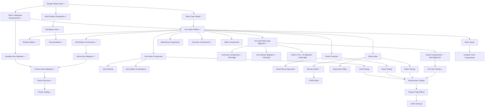

# LESS to makeStyles Migration Dependency Graph

## Overview
This document visualizes the dependencies between migration tasks, helping identify which tasks can be done in parallel and which must be done sequentially.

## Dependency Flow Diagram

## Critical Path Analysis

### Sequential Dependencies (Must be done in order)

#### Path 1: Token Foundation ✅ **COMPLETED**
1. ✅ Design Tokens Audit (2 days) - COMPLETED
2. ✅ Token Categories Enhancement (3 days) - COMPLETED  
3. ✅ Core Style Utilities (3 days) - COMPLETED
4. ✅ Component Migration Start - ACTIVE

**Status: ✅ UNBLOCKED - Components can now migrate freely**

#### Path 2: Shared Resources ✅ **COMPLETED**
1. ✅ Variables.less Migration (2 days) - COMPLETED
2. ✅ Common.less Migration (2 days) - COMPLETED
3. ✅ Theme Structure (3 days) - COMPLETED
4. ✅ Theme Testing (2 days) - COMPLETED

**Status: ✅ INFRASTRUCTURE COMPLETE**

#### Path 3: VS Code App Migration ✅ **COMPLETED AHEAD OF SCHEDULE** 
1. ✅ Export Components Migration - COMPLETED (PRs #7588, #7797)
2. ✅ Overview Components Migration - COMPLETED (PR #7588)
3. ✅ Icon System Modernization - COMPLETED (PR #7820)
4. ✅ Fluent UI v8→v9 Migration - COMPLETED (PR #7588)

**Status: ✅ MAJOR MILESTONE ACHIEVED**

### Parallel Execution Opportunities

#### Track A: Infrastructure (Can start Day 1)
- Build System Preparation
- Developer Tools
- Documentation
- Testing Utilities

#### Track B: Independent Components (Can start after Day 8)
**Team Member 1:**
- Card Components (10 subtasks)
- Card Variants (5 subtasks)

**Team Member 2:**
- Panel Components (7 subtasks)
- Panel Sub-components (5 subtasks)

**Team Member 3:**
- Editor Base Components (5 subtasks)
- Monaco/Expression Editors (8 subtasks)

**Team Member 4:**
- Monitoring Components
- Overview Components
- Table Components

## Resource Allocation Strategy

### ✅ Week 1-2: Foundation Sprint **COMPLETED**
**4 developers needed:**
- ✅ Developer 1: Design Tokens & Type Safety - COMPLETED
- ✅ Developer 2: Build System & Developer Tools - COMPLETED 
- ✅ Developer 3: Style Utilities & Mixins - COMPLETED
- ✅ Developer 4: Documentation & Testing Setup - COMPLETED

### ✅ Week 3-4: Shared Resources Sprint **COMPLETED**
**3 developers needed:**
- ✅ Developer 1: Variables & Common migration - COMPLETED
- ✅ Developer 2: Theme System - COMPLETED
- ✅ Developer 3: Continue utilities & start component prep - COMPLETED

### ✅ **BONUS**: VS Code React App Sprint **COMPLETED AHEAD OF SCHEDULE**
**Major achievement through 3 strategic PRs:**
- ✅ PR #7588: Comprehensive Fluent UI v8→v9 migration (16 components)
- ✅ PR #7797: Export component LESS→makeStyles migration  
- ✅ PR #7820: SVG→Fluent UI icons modernization

### Week 5-12: Component Migration Sprint **IN PROGRESS**
**4-6 developers recommended:**
- Divide by component domains
- Each developer owns 2-3 component groups
- Parallel execution maximized
- **Current focus**: Designer-ui library components (remaining 109 files)

## Blocking Dependencies

### High Priority Blockers
1. **Design Tokens** - Blocks all component work
2. **Core Style Utilities** - Blocks all component work
3. **Theme Structure** - Blocks theme-specific styling

### Medium Priority Blockers
1. **Variables.less** - Blocks components using those variables
2. **Mixins.less** - Blocks components using those mixins
3. **Build System** - Blocks production deployment

## Optimization Strategies

### 1. Fast Track Critical Path
- Prioritize Design Tokens completion
- Get minimal viable utilities ready
- Start component migration ASAP

### 2. Prototype Pattern
- Complete one full component (Card) first
- Use as reference for other migrations
- Refine patterns based on learnings

### 3. Continuous Integration
- Merge completed components daily
- Keep both LESS and makeStyles working
- Use feature flags for gradual rollout

## Risk Mitigation Through Dependencies

### Dependency Risks
1. **Token Changes**: Could affect all migrated components
   - Mitigation: Lock tokens early, version them
   
2. **Utility Function Bugs**: Could break multiple components
   - Mitigation: Comprehensive testing, gradual adoption
   
3. **Theme System Issues**: Could affect entire app
   - Mitigation: A/B test with feature flags

### Parallel Work Risks
1. **Inconsistent Patterns**: Different developers might use different approaches
   - Mitigation: Daily sync, code reviews, pattern library
   
2. **Merge Conflicts**: Multiple teams working on shared files
   - Mitigation: Clear ownership, frequent merges

## Milestone Checkpoints

### ✅ Checkpoint 1 (End of Week 2) **COMPLETED**
- ✅ All tokens defined
- ✅ Utilities ready  
- ✅ First component migrated

### ✅ Checkpoint 2 (End of Week 4) **COMPLETED** 
- ✅ Shared resources migrated
- ✅ Theme system working
- ✅ 26.6% components migrated (ahead of 25% target)

### ✅ **BONUS MILESTONE**: VS Code App Complete **ACHIEVED EARLY**
- ✅ Complete VS Code React app migrated
- ✅ Fluent UI v8→v9 transformation completed
- ✅ Icon system modernized
- ✅ LESS→makeStyles conversion for VS Code components

### Checkpoint 3 (End of Week 8) **IN PROGRESS**
- [ ] 60% components migrated (currently at 26.6%)
- [ ] Performance validated
- [ ] Testing suite updated

### Checkpoint 4 (End of Week 12)
- [ ] 100% components migrated
- [ ] LESS dependencies removed
- [ ] Production deployment ready

## Dependency Matrix

| Task | Depends On | Blocks | Can Parallel With |
|------|-----------|--------|-------------------|
| Design Tokens Audit | None | All components | Build System |
| Token Categories | Token Audit | Style Utilities | Documentation |
| Style Utilities | Tokens | All components | Testing Utils |
| Build System | None | Production | All development |
| Card Component | Style Utilities | Card Variants | Panel, Editor |
| Panel Component | Style Utilities | None | Card, Editor |
| Theme System | Variables, Common | Theme Testing | Components |
| Testing | Each component | Rollout | Other testing |

## Next Steps

1. Assign developers to parallel tracks
2. Set up daily dependency check-ins
3. Create blocking issue board
4. Implement dependency tracking in project management tool
5. Regular critical path reviews