# LESS to makeStyles Migration Dependency Graph

## Overview
This document visualizes the dependencies between migration tasks, helping identify which tasks can be done in parallel and which must be done sequentially. **Updated to reflect current progress as of Branch: ccastrotrejo/FinalMigration**

**Current Status**: 38.8% complete (40+ components migrated)

## Dependency Flow Diagram

```mermaid
graph TD
    %% Phase 1: Foundation - COMPLETED ✅
    A[Design Tokens Audit] --> B[Token Categories Enhancement] 
    A --> C[Token Type Safety]
    B --> D[Core Style Utilities]
    C --> D
    D --> E[LESS Mixin Conversions]
    D --> F[Testing Utilities]
    
    %% Infrastructure - COMPLETED ✅
    A --> G[Build System Preparation]
    G --> H[Developer Tools]
    H --> I[Documentation]
    
    %% Phase 2: Shared Resources - COMPLETED ✅
    B --> J[Variables.less Migration ✅]
    E --> K[Mixins.less Migration ✅]
    J --> L[Common.less Migration ✅]
    K --> L
    L --> M[Theme Structure]
    M --> N[Theme Testing]
    
    %% Phase 3: Components - IN PROGRESS 🚧
    D --> O[Card Base Component 🚧]
    O --> P[Card Variants 🚧]
    O --> Q[Card States & Animations 🚧]
    
    D --> R[Panel Container 🚧]
    R --> S[Panel Sub-components 🚧]
    
    D --> T[Editor Base 🚧]
    T --> U[Monaco Editor ✅]
    T --> V[Expression Editor 🚧]
    U --> W[HTML Editor 🚧]
    
    D --> X[Basic Inputs ✅]
    X --> Y[Complex Form Components 🚧]
    
    %% Parallel tracks - VARIOUS PROGRESS
    D --> Z[Monitoring Components 🚧]
    D --> AA[Overview Components ✅]
    D --> AB[Table Components ✅]
    
    %% VS Code App - COMPLETED ✅
    D --> AC[VS Code Export ✅]
    D --> AD[VS Code Components ✅]
    AC --> AE[VS Code Fluent UI v9 ✅]
    AD --> AE
    
    %% Testing - ONGOING
    O --> AF[Card Testing 🚧]
    R --> AG[Panel Testing 🚧]
    T --> AH[Editor Testing 🚧]
    AE --> AI[VS Code Testing ✅]
    
    %% Final phases - PENDING
    AF --> AJ[Performance Testing 🔄]
    AG --> AJ
    AH --> AJ
    AI --> AJ
    AJ --> AK[Feature Flag Rollout 📋]
    AK --> AL[LESS Cleanup 📋]
    
    %% Legend
    classDef completed fill:#90EE90,stroke:#006400,stroke-width:2px
    classDef inProgress fill:#FFE4B5,stroke:#FF8C00,stroke-width:2px
    classDef pending fill:#F0F8FF,stroke:#4682B4,stroke-width:2px
    
    class A,B,C,D,E,F,G,H,I,J,K,L,AA,AB,AC,AD,AE,AI,U,X completed
    class O,P,Q,R,S,T,V,Y,Z,AF,AG,AH inProgress
    class M,N,W,AJ,AK,AL pending
```

## Critical Path Analysis

### Sequential Dependencies (Must be done in order)

#### Path 1: Token Foundation ✅ **COMPLETED**
1. ✅ Design Tokens Audit (2 days) - COMPLETED
2. ✅ Token Categories Enhancement (3 days) - COMPLETED
3. ✅ Core Style Utilities (3 days) - COMPLETED
4. ✅ Component Migration Started - 40+ components migrated

**Status**: ✅ **COMPLETED** - Foundation established, components can now be migrated independently

#### Path 2: Shared Resources ✅ **COMPLETED**
1. ✅ Variables.less Migration (2 days) - COMPLETED
2. ✅ Mixins.less Migration (3 days) - COMPLETED
3. ✅ Common.less Migration (2 days) - COMPLETED
4. 🚧 Theme Structure (3 days) - IN PROGRESS
5. 📋 Theme Testing (2 days) - PENDING

**Status**: ✅ **CORE INFRASTRUCTURE COMPLETED** - Theme work in progress

### Parallel Execution Opportunities

#### Track A: Infrastructure ✅ **COMPLETED**
- ✅ Build System Preparation - COMPLETED
- ✅ Developer Tools - COMPLETED
- ✅ Documentation - COMPLETED  
- ✅ Testing Utilities - COMPLETED

#### Track B: Component Teams (Currently Active 🚧)
**Team Member 1: Card Components (IN PROGRESS)**
- 🚧 Card Components (10 subtasks) - 60% complete
- 🚧 Card Variants (5 subtasks) - 40% complete

**Team Member 2: Panel Components (IN PROGRESS)**
- 🚧 Panel Components (7 subtasks) - 30% complete
- 🚧 Panel Sub-components (5 subtasks) - 20% complete

**Team Member 3: VS Code App ✅ COMPLETED**
- ✅ Export Components - COMPLETED
- ✅ Overview Components - COMPLETED
- ✅ ReviewList Components - COMPLETED
- ✅ Table Components - COMPLETED
- ✅ SearchableDropdown - COMPLETED
- ✅ Fluent UI v9 Migration - COMPLETED

#### Track C: Editor Components (READY TO START)
**Team Member 4: Editor Components**
- ✅ Monaco Editor - COMPLETED
- 🚧 Expression Editor - CAN START NOW
- 📋 HTML Editor - CAN START NOW

#### Track D: Form Components (READY TO START)
**Team Member 5: Form Components**
- ✅ Basic Inputs - COMPLETED
- 🚧 Complex Form Components - CAN START NOW

### Current Bottlenecks Resolved
- ✅ **Foundation Infrastructure**: All blocking dependencies completed
- ✅ **Shared Resources**: Core infrastructure available for all teams
- ✅ **VS Code App**: Complete modern architecture established
- 🚧 **Component Migration**: Multiple teams can work in parallel
- 📋 **Final Cleanup**: Waiting for component completion

## Migration Progress Summary

### ✅ **Phase 1 & 2: COMPLETED (100%)**
- Foundation infrastructure established
- Shared resources migrated (variables, mixins, common styles)
- VS Code React app fully migrated to Fluent UI v9
- 40+ makeStyles files created

### 🚧 **Phase 3: IN PROGRESS (60%)**
- Card components migration ongoing
- Panel components migration ongoing
- Editor components ready to start
- Form components ready to start

### 📋 **Phase 4: READY TO START**
- Remaining application-specific styles
- Data mapper migration
- Final cleanup and optimization

**Overall Progress**: 38.8% complete with solid foundation and major application migrations completed.

**Team Member 3:**
- Editor Base Components (5 subtasks)
- Monaco/Expression Editors (8 subtasks)

**Team Member 4:**
- Monitoring Components
- [x] Overview Components - ✅ COMPLETED (VS Code overview.less → overviewStyles.ts)
- [x] Panel Components - ✅ COMPLETED (NodeSearchPanel with Tabster focus management)
- Table Components

#### Track C: VS Code Application Components (SIGNIFICANT PROGRESS)
**Recently Completed:**
- [x] Export Components (export.less → exportStyles.ts) - ✅ COMPLETED (PR #7588/#7797)
- [x] Overview App (overview.less → overviewStyles.ts) - ✅ COMPLETED (PR #7588)
- [x] ReviewList Component (styles.less → reviewListStyles.ts) - ✅ COMPLETED (PR #7907) - **COMPLEX MIGRATION**
  - Complete architectural migration: GroupedList/DetailsRow → Tree component
  - Fluent UI v8 → v9 component migration included
  - File completely removed from codebase
- [x] SVG Icon Migration (3 SVG files → Fluent UI icons) - ✅ COMPLETED (PR #7820)

## Resource Allocation Strategy

### Week 1-2: Foundation Sprint
**4 developers needed:**
- Developer 1: Design Tokens & Type Safety
- Developer 2: Build System & Developer Tools
- Developer 3: Style Utilities & Mixins
- Developer 4: Documentation & Testing Setup

### Week 3-4: Shared Resources Sprint
**3 developers needed:**
- Developer 1: Variables & Common migration
- Developer 2: Theme System
- Developer 3: Continue utilities & start component prep

### Week 5-12: Component Migration Sprint
**4-6 developers recommended:**
- Divide by component domains
- Each developer owns 2-3 component groups
- Parallel execution maximized

## Blocking Dependencies

### High Priority Blockers
1. **Design Tokens** - Blocks all component work
2. **Core Style Utilities** - Blocks all component work
3. **Theme Structure** - Blocks theme-specific styling

### Medium Priority Blockers
1. **Variables.less** - Blocks components using those variables
2. **Mixins.less** - Blocks components using those mixins
3. **Build System** - Blocks production deployment

## Optimization Strategies

### 1. Fast Track Critical Path
- Prioritize Design Tokens completion
- Get minimal viable utilities ready
- Start component migration ASAP

### 2. Prototype Pattern
- Complete one full component (Card) first
- Use as reference for other migrations
- Refine patterns based on learnings

### 3. Continuous Integration
- Merge completed components daily
- Keep both LESS and makeStyles working
- Use feature flags for gradual rollout

## Risk Mitigation Through Dependencies

### Dependency Risks
1. **Token Changes**: Could affect all migrated components
   - Mitigation: Lock tokens early, version them
   
2. **Utility Function Bugs**: Could break multiple components
   - Mitigation: Comprehensive testing, gradual adoption
   
3. **Theme System Issues**: Could affect entire app
   - Mitigation: A/B test with feature flags

### Parallel Work Risks
1. **Inconsistent Patterns**: Different developers might use different approaches
   - Mitigation: Daily sync, code reviews, pattern library
   
2. **Merge Conflicts**: Multiple teams working on shared files
   - Mitigation: Clear ownership, frequent merges

## Milestone Checkpoints

### Checkpoint 1 (End of Week 2)
- ✓ All tokens defined
- ✓ Utilities ready
- ✓ First component migrated

### Checkpoint 2 (End of Week 4)
- ✓ Shared resources migrated
- ✓ Theme system working
- ✓ 25% components migrated

### Checkpoint 3 (End of Week 8) - **CURRENT STATUS**
- ✓ ~28.2% components migrated (35 of 124 components)
- ✓ VS Code application components significantly advanced
- ✓ **MAJOR**: ReviewList complete architecture migration (GroupedList → Tree) with file removal
- ✓ Fluent UI v8 → v9 migration patterns established and refined
- ✓ SVG → Fluent UI icon migration completed for VS Code
- ✓ **NEW**: NodeSearchPanel migration with Tabster focus management (Branch: ccastrotrejo/panelSearchMigration)
- ✓ Added `tabster: 8.5.6` dependency for advanced accessibility features
- ✓ Complex component migration patterns validated (Tree, Skeleton components)
- ⚠️ Performance validation in progress
- ✓ Testing suite updated

### Checkpoint 4 (End of Week 12)
- [ ] 100% components migrated
- [ ] LESS dependencies removed
- [ ] Production deployment ready

## Dependency Matrix

| Task | Depends On | Blocks | Can Parallel With |
|------|-----------|--------|-------------------|
| Design Tokens Audit | None | All components | Build System |
| Token Categories | Token Audit | Style Utilities | Documentation |
| Style Utilities | Tokens | All components | Testing Utils |
| Build System | None | Production | All development |
| Card Component | Style Utilities | Card Variants | Panel, Editor |
| Panel Component | Style Utilities | None | Card, Editor |
| Theme System | Variables, Common | Theme Testing | Components |
| Testing | Each component | Rollout | Other testing |

## Next Steps

1. Assign developers to parallel tracks
2. Set up daily dependency check-ins
3. Create blocking issue board
4. Implement dependency tracking in project management tool
5. Regular critical path reviews