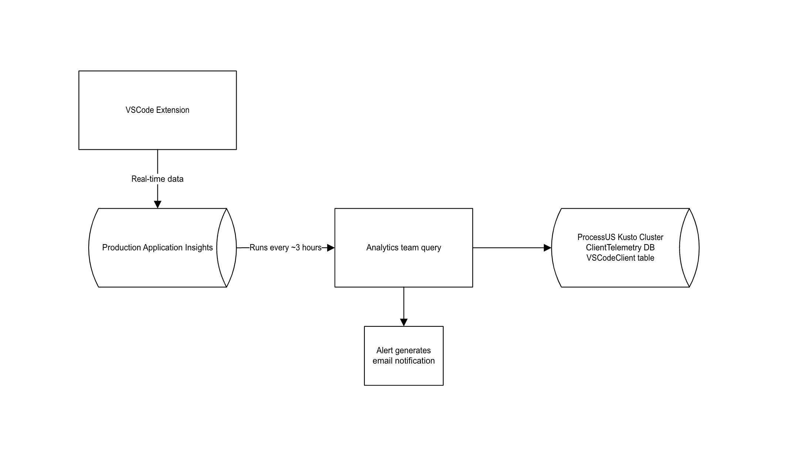

# Kusto and Application Insights

- How we pull data from AI to Kusto :

## Kusto

### Accessing data

- Logs for VSCode can be found in the [ClientTelemetry database of the ProcessUS cluster](https://dataexplorer.azure.com/clusters/processus/databases/ClientTelemetry)
- Read access to the database is available through the ‘Process*’ myaccess group

### Under the hood

- Query used to fetch data from AI can be viewed and edited [from the repo](https://msazure.visualstudio.com/One/_git/AAPT-Antares-Analytics?path=%2Fsrc%2FAnalyticsCmd%2FAppInsights%2FQueries%2FDataMapperEvents.csl&version=GC90d059210bc7059b538582dd6f5276809882a801)
- Azure alert to notify if query fails- [alert](https://azurealerting.trafficmanager.net/alert/05f1d5e3-e367-4ffa-a8a6-d08a1e5b4ad7)

## Application Insights

### Access

- Real time logs can be found in our [Application Insights instance](https://ms.portal.azure.com/#@MSAzureCloud.onmicrosoft.com/resource/subscriptions/4bb604d0-3eaa-4194-ab38-26cdc69a7f44/resourcegroups/VSCodeExtension/providers/microsoft.insights/components/logic-apps-vscode/) (JIT required for read access)