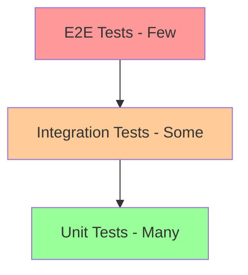

# Testing Guide

This comprehensive guide covers all aspects of testing in the Logic Apps UX project, from unit tests to end-to-end testing.

## Testing Philosophy

We follow a testing pyramid approach:



- **Unit Tests**: Fast, focused, numerous
- **Integration Tests**: Test component interactions
- **E2E Tests**: Test complete user flows

## Unit Testing

### Framework and Tools

We use **Vitest** with **React Testing Library** for unit testing:

- **Vitest**: Fast, Vite-native test runner
- **React Testing Library**: Testing from user's perspective
- **MSW**: Mock Service Worker for API mocking
- **Testing Library User Event**: Realistic user interactions

### Writing Unit Tests

#### Basic Component Test

```typescript
import { render, screen } from '@testing-library/react';
import userEvent from '@testing-library/user-event';
import { WorkflowCard } from './WorkflowCard';

describe('WorkflowCard', () => {
  it('should display workflow name', () => {
    render(<WorkflowCard name="My Workflow" status="Running" />);
    
    expect(screen.getByText('My Workflow')).toBeInTheDocument();
    expect(screen.getByText('Running')).toBeInTheDocument();
  });
  
  it('should handle click events', async () => {
    const user = userEvent.setup();
    const handleClick = vi.fn();
    
    render(<WorkflowCard name="My Workflow" onClick={handleClick} />);
    
    await user.click(screen.getByRole('button'));
    
    expect(handleClick).toHaveBeenCalledTimes(1);
  });
});
```

#### Testing Hooks

```typescript
import { renderHook, act } from '@testing-library/react';
import { useCounter } from './useCounter';

describe('useCounter', () => {
  it('should increment counter', () => {
    const { result } = renderHook(() => useCounter());
    
    expect(result.current.count).toBe(0);
    
    act(() => {
      result.current.increment();
    });
    
    expect(result.current.count).toBe(1);
  });
});
```

#### Testing Redux State

```typescript
import { renderWithProviders } from '@/test-utils';
import { screen } from '@testing-library/react';
import { DesignerPanel } from './DesignerPanel';

describe('DesignerPanel with Redux', () => {
  it('should display workflow from store', () => {
    const preloadedState = {
      designer: {
        workflow: {
          name: 'Test Workflow',
          id: '123'
        }
      }
    };
    
    renderWithProviders(<DesignerPanel />, { preloadedState });
    
    expect(screen.getByText('Test Workflow')).toBeInTheDocument();
  });
});
```

### Running Unit Tests

```bash
# Run all unit tests
pnpm run test:lib

# Run tests in watch mode
pnpm vitest --watch

# Run tests with coverage
pnpm vitest --coverage

# Run specific test file
pnpm vitest Button.test.tsx

# Run tests matching pattern
pnpm vitest --grep "should handle click"
```

### Test Coverage

We aim for:
- **80%+ coverage** for utilities and hooks
- **70%+ coverage** for components
- **Critical paths** must have 100% coverage

View coverage report:
```bash
pnpm vitest --coverage --ui
```

## Integration Testing

### Testing Component Integration

```typescript
import { render, screen, waitFor } from '@testing-library/react';
import { rest } from 'msw';
import { setupServer } from 'msw/node';
import { WorkflowList } from './WorkflowList';

// Setup MSW server
const server = setupServer(
  rest.get('/api/workflows', (req, res, ctx) => {
    return res(ctx.json([
      { id: '1', name: 'Workflow 1' },
      { id: '2', name: 'Workflow 2' }
    ]));
  })
);

beforeAll(() => server.listen());
afterEach(() => server.resetHandlers());
afterAll(() => server.close());

describe('WorkflowList Integration', () => {
  it('should load and display workflows', async () => {
    render(<WorkflowList />);
    
    // Wait for loading to finish
    await waitFor(() => {
      expect(screen.queryByText('Loading...')).not.toBeInTheDocument();
    });
    
    // Check workflows are displayed
    expect(screen.getByText('Workflow 1')).toBeInTheDocument();
    expect(screen.getByText('Workflow 2')).toBeInTheDocument();
  });
});
```

## End-to-End Testing

### Playwright Setup

We use [Playwright](https://playwright.dev/) for E2E testing across browsers.

#### Test Categories

1. **Mock API Tests** (`@mock` tag)
   - Run with mock data
   - No external dependencies
   - Fast and reliable
   - Run on every PR

2. **Real API Tests**
   - Test against live Azure services
   - Require authentication
   - Run hourly in CI
   - More comprehensive

### Writing E2E Tests

#### Basic E2E Test

```typescript
import { test, expect } from '@playwright/test';

test.describe('Workflow Designer E2E', () => {
  test.beforeEach(async ({ page }) => {
    await page.goto('/');
  });
  
  test('should create a simple workflow @mock', async ({ page }) => {
    // Click create workflow button
    await page.getByRole('button', { name: 'Create workflow' }).click();
    
    // Add HTTP trigger
    await page.getByTestId('add-trigger').click();
    await page.getByText('When a HTTP request is received').click();
    
    // Configure trigger
    await page.getByLabel('Method').selectOption('POST');
    
    // Add action
    await page.getByTestId('add-action').click();
    await page.getByPlaceholder('Search actions').fill('response');
    await page.getByText('Response').first().click();
    
    // Save workflow
    await page.getByRole('button', { name: 'Save' }).click();
    
    // Verify success
    await expect(page.getByText('Workflow saved')).toBeVisible();
  });
});
```

#### Page Object Model

```typescript
// pages/DesignerPage.ts
import { Page } from '@playwright/test';

export class DesignerPage {
  constructor(private page: Page) {}
  
  async goto() {
    await this.page.goto('/designer');
  }
  
  async addTrigger(triggerName: string) {
    await this.page.getByTestId('add-trigger').click();
    await this.page.getByText(triggerName).click();
  }
  
  async addAction(actionName: string) {
    await this.page.getByTestId('add-action').click();
    await this.page.getByPlaceholder('Search actions').fill(actionName);
    await this.page.getByText(actionName).first().click();
  }
  
  async saveWorkflow() {
    await this.page.getByRole('button', { name: 'Save' }).click();
  }
}

// tests/workflow.spec.ts
import { test, expect } from '@playwright/test';
import { DesignerPage } from '../pages/DesignerPage';

test('create workflow using page object', async ({ page }) => {
  const designer = new DesignerPage(page);
  
  await designer.goto();
  await designer.addTrigger('Manual trigger');
  await designer.addAction('Send an email');
  await designer.saveWorkflow();
  
  await expect(page.getByText('Workflow saved')).toBeVisible();
});
```

### Running E2E Tests

#### Mock API Tests

```bash
# Run mock API tests
pnpm run test:e2e --grep @mock

# Run specific test file
pnpm run test:e2e designer/workflow.spec.ts

# Run in headed mode (see browser)
pnpm run test:e2e --headed

# Run in debug mode
pnpm run test:e2e --debug
```

#### Real API Tests

First, set up environment variables:

```bash
# Create .env file in root
AZURE_SITE_NAME="your-logic-app-name"
AZURE_SUBSCRIPTION_ID="your-subscription-id"
AZURE_RESOURCE_GROUP="your-resource-group"
AZURE_MANAGEMENT_TOKEN="your-arm-token"
```

Generate ARM token:
```bash
pnpm run generateArmToken
```

Run tests:
```bash
# Run all real API tests
pnpm run test:e2e

# Run specific real API test
pnpm run test:e2e --grep "real api test name"
```

### E2E Test Best Practices

1. **Use data-testid** for reliable element selection
2. **Wait for elements** instead of arbitrary delays
3. **Clean up** resources after tests
4. **Use fixtures** for test data
5. **Parallelize** tests when possible

```typescript
// Good practices
test.describe.parallel('Workflow Tests', () => {
  test('test 1', async ({ page }) => {
    // Use data-testid
    await page.getByTestId('workflow-trigger').click();
    
    // Wait for elements
    await expect(page.getByText('Saved')).toBeVisible();
    
    // Clean up
    await page.getByTestId('delete-workflow').click();
  });
});
```

### Debugging E2E Tests

#### Using Playwright Inspector

```bash
# Run with inspector
pnpm run test:e2e --debug

# Use page.pause() in tests
test('debug this test', async ({ page }) => {
  await page.goto('/');
  await page.pause(); // Opens inspector here
  await page.click('button');
});
```

#### View Test Reports

```bash
# After test run
pnpm exec playwright show-report

# View trace files
pnpm exec playwright show-trace trace.zip
```

#### Common Issues

**Port 4200 still in use**
```bash
# macOS/Linux
lsof -ti:4200 | xargs kill -9

# Windows
netstat -ano | findstr :4200
taskkill /PID <pid> /F
```

**Tests timing out**
```typescript
// Increase timeout for specific test
test('slow test', async ({ page }) => {
  test.setTimeout(60000); // 60 seconds
  // test code
});
```

## Test Organization

### File Structure

```
src/
├── components/
│   ├── Button/
│   │   ├── Button.tsx
│   │   ├── Button.test.tsx      # Unit tests
│   │   └── Button.stories.tsx   # Storybook stories
├── hooks/
│   ├── useWorkflow.ts
│   └── useWorkflow.test.ts
├── utils/
│   ├── validation.ts
│   └── validation.test.ts
e2e/
├── designer/
│   ├── workflow.spec.ts
│   └── fixtures/
│       └── workflows.json
├── data-mapper/
│   └── mapping.spec.ts
└── pages/
    └── DesignerPage.ts
```

### Test Utilities

Create reusable test utilities:

```typescript
// test-utils/render.tsx
import { render } from '@testing-library/react';
import { Provider } from 'react-redux';
import { IntlProvider } from 'react-intl';

export function renderWithProviders(
  ui: React.ReactElement,
  options?: RenderOptions
) {
  function Wrapper({ children }: { children: React.ReactNode }) {
    return (
      <Provider store={store}>
        <IntlProvider locale="en">
          {children}
        </IntlProvider>
      </Provider>
    );
  }
  
  return render(ui, { wrapper: Wrapper, ...options });
}
```

## Continuous Integration

### GitHub Actions

Tests run automatically on:
- Pull request creation
- Commits to main
- Scheduled (hourly for real API tests)

### Test Requirements

PRs must pass:
- ✅ All unit tests
- ✅ All mock E2E tests
- ✅ Linting and type checking
- ✅ Minimum code coverage

## Performance Testing

### Component Performance

```typescript
import { render } from '@testing-library/react';
import { measureRender } from '@/test-utils/performance';

test('WorkflowCanvas renders efficiently', async () => {
  const renderTime = await measureRender(
    <WorkflowCanvas nodes={largeNodeSet} />
  );
  
  expect(renderTime).toBeLessThan(100); // ms
});
```

### Bundle Size Testing

```bash
# Check bundle size
pnpm run build:lib -- --metafile
pnpm exec esbuild-visualizer

# Set size limits in package.json
"size-limit": [
  {
    "path": "dist/index.js",
    "limit": "500 KB"
  }
]
```

## Accessibility Testing

### Automated A11y Tests

```typescript
import { render } from '@testing-library/react';
import { axe, toHaveNoViolations } from 'jest-axe';

expect.extend(toHaveNoViolations);

test('Button is accessible', async () => {
  const { container } = render(<Button>Click me</Button>);
  const results = await axe(container);
  
  expect(results).toHaveNoViolations();
});
```

## Testing Checklist

Before submitting PR:

- [ ] Unit tests written for new code
- [ ] Integration tests for complex features
- [ ] E2E tests for user flows
- [ ] Tests pass locally
- [ ] Coverage meets requirements
- [ ] No skipped or commented tests
- [ ] Test names are descriptive
- [ ] Mocks are properly cleaned up

Happy testing! 🧪