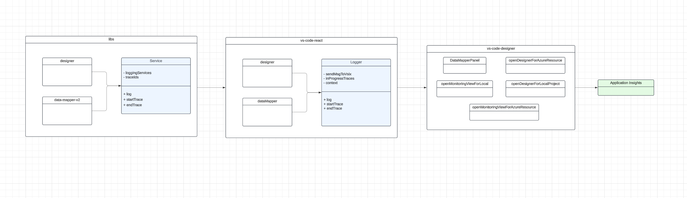

# Logging

### VSCode

We log in VSCode two different ways, for the individual libraries and the VSCode app.

We store the Application Insights IKey and Connection String (we need to replace IKey with connection string before they stop supporting it according to these [docs](https://www.bing.com/ck/a?!&&p=2ca732e0bf41371ba66545baf1e347ebc8dd4c604e5c1c6c9d959e4c610ad604JmltdHM9MTczMzk2MTYwMA&ptn=3&ver=2&hsh=4&fclid=3441c1a0-fa32-6667-3dc4-d01cfb886781&psq=app+insights+connection+string&u=a1aHR0cHM6Ly9sZWFybi5taWNyb3NvZnQuY29tL2VuLXVzL2F6dXJlL2F6dXJlLW1vbml0b3IvYXBwL21pZ3JhdGUtZnJvbS1pbnN0cnVtZW50YXRpb24ta2V5cy10by1jb25uZWN0aW9uLXN0cmluZ3M&ntb=1)) in our production-build.yml file.

We use [ApplicationInsights](https://www.npmjs.com/package/@microsoft/applicationinsights-web) to gather our logs, and then they are sent to Kusto for easier querying.

#### VSCode logging within app

We log VSCode commands with 'callWithTelemetryAndErrorHandling' from [VSCode Azure SDK for Node.js](https://www.npmjs.com/package/@microsoft/vscode-azext-utils).
This function logs our telemetry and shows errors in VSCode at the same time.

Here we mainly log extension commands. The name is name of the command like this: 'vscode-azurelogicapps/azureLogicAppsStandard.dataMap.createNewDataMap'.

 This value is copied over to the package.json of vs-code-designer during the github build.  where we read it and initialize App Insights using the library in the file 'apps/vs-code-designer/src/app/commands/logstream/startStreamingLogs.ts', using the library above.

#### VSCode logs from Libraries

Using the LoggerService in apps/vs-code-react/src/app/services/Logger.ts that implements ILoggerService in vs-code-react. This service sends commands to vs-code-designer to log. vs-code-designer uses the library [vscode-extension-telemetry](https://github.com/microsoft/vscode-extension-telemetry) initialized in apps/vs-code-designer/src/main.ts to log.

In the github build we copy over the key from production-build.yml into main.ts in vs-code-designer.

##### Testing locally

To test telemetry changes locally
1. Get IKey from this [test AI resource](https://ms.portal.azure.com/#@microsoft.onmicrosoft.com/resource/subscriptions/80d4fe69-c95b-4dd2-a938-9250f1c8ab03/resourcegroups/laux/providers/microsoft.insights/components/VSCodeTelemetry/overview)
2. Copy this value and replace setInGitHubBuild with the IKey
3. Build and test the extension
4. View [log data](https://ms.portal.azure.com/#@microsoft.onmicrosoft.com/resource/subscriptions/80d4fe69-c95b-4dd2-a938-9250f1c8ab03/resourcegroups/laux/providers/microsoft.insights/components/VSCodeTelemetry/logs).Logs are stored in the customEvents table.

### Data Mapper Library

Log categories are found in libs/data-mapper-v2/src/utils/Logging.Utils.ts

Depending on whether or not we are in development or production mode, logs will go to AI or the console.

Service initialized in DataMapperDesigner.tsx

We can use the prefix of the name to query for logs related to Data Mapper- 'data-mapper-vscode-extension'. We should eventually separate the logs of v1 from v2 by changing the prefix.

### Designer and Portal

Uses logging from 'logic-apps-shared', designer-client-services has a generic logger service used for standalone and Portal.

Portal implements ILoggerService, initializing AI with a portal library @microsoft/azureportal-reactview/Az

