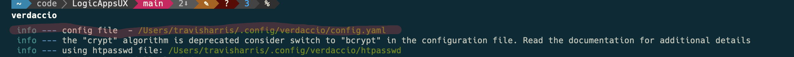

import Tabs from '@theme/Tabs';
import TabItem from '@theme/TabItem';

# Local Development in Dependencies

When you're developing the designer locally, the standalone editor available in the LAUX repository provides extensive functionality. However, in most scenarios, it's crucial to integrate and test it with a host application.

## Installing and Setting up Verdaccio

verdaccio documentation can be found here: https://verdaccio.org/
verdaccio is a lightweight private npm proxy registry. It allows you to have a local npm registry to cache packages and to publish your own packages. This allows us to publish local packages to be used anywhere._createMdxContent
This is something you can run on your PC to proxy ALL calls through and have it running all of the time. You can also run it just for testing. The former is what this guide will help set up. 

1. Install verdaccio globally and initialize the configuration file
```bash
npm install -g verdaccio 
verdaccio 
```

:::note
Make note of the config location of verdaccio on the first line after you run it. It will be something like `C:\Users\username\.config\verdaccio\config.yaml`


:::

:::warning

Step 2 is optional. If you want to use the default configuration, you can skip this step.
It is required for microsoft employees working on Azure Portal

:::
2. Setup config to have the correct uplink registery. For LAUX, this is the microsoft-logic-apps Azure Artifacts registery.
2A. Get a PAT set
Get a PAT from Azure devops and run this script in your terminal:
```bash 
node -e "require('readline') .createInterface({input:process.stdin,output:process.stdout,historySize:0}) .question('PAT> ',p => { b64=Buffer.from('test:' + p.trim()).toString('base64');console.log(b64);process.exit(); })"
```
and put your Azure Dev Ops PAT into the prompt. This will give you a base64 encoded string that you can use as the token in the config file.

Using the config location above. Replace the contents(everything below the topline storage item, leave that as is) with this:

```yaml
storage: LEAVE THIS LINE AS IS
plugins: ./plugins

web:
  title: Verdaccio

auth:
  htpasswd:
    file: ./htpasswd
uplinks:
  npmjs:
    url: https://msazure.pkgs.visualstudio.com/One/_packaging/microsoft-logic-apps/npm/registry
    auth:
      type: basic
      token: '<AZURE_DEV_OPS_TOKEN_HERE>'

packages:
  '@*/*':
    access: $all
    publish: $all
    unpublish: $all
    proxy: npmjs

  '**':
    access: $all
    publish: $all
    unpublish: $all
    proxy: npmjs

server:
  keepAliveTimeout: 60

middlewares:
  audit:
    enabled: true
log: { type: stdout, format: pretty, level: http }

```
3. Install pm2 and start verdaccio as a service

```bash
npm install -g pm2 
pm2 start verdaccio --watch
```


4. Set the global repo on your machine to proxy through verdaccio
:::info

This can also be done on the .npmrc of the repo levels if preferred.

:::

```bash 
npm set registry http://localhost:4873/
```

:::note

1-4 are one time setup steps. You can now publish packages to verdaccio and install them from there.

:::
5. Publish the package to verdaccio
from the LAUX repo root:
```bash
pnpm turbo run publish:local
```

6. Install the package from verdaccio
Just go to the target app and update the versions of the package.json to the current versions published to verdaccio. Then run npm install noramlly.