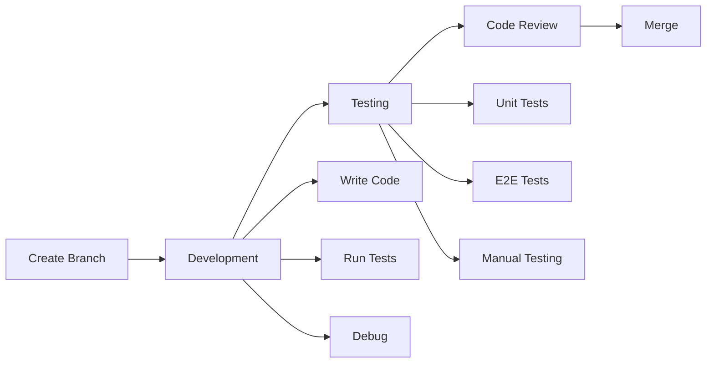

# Development Workflow

This guide covers the day-to-day development workflow for contributing to the Logic Apps UX project, from setting up your feature branch to getting your code merged.

## Development Process Overview



## Setting Up Your Development Environment

### 1. Create a Feature Branch

Always create a new branch from the latest `main`:

```bash
# Update your local main branch
git checkout main
git pull origin main

# Create and checkout a new feature branch
git checkout -b feature/your-feature-name

# For bug fixes
git checkout -b fix/bug-description

# For documentation
git checkout -b docs/what-you-are-documenting
```

### 2. Start Development Server

```bash
# Start the standalone designer (most common)
pnpm run start

# Or start specific apps
pnpm turbo run dev --filter=standalone
pnpm turbo run dev --filter=vs-code-react
```

The development server includes:
- **Hot Module Replacement (HMR)** - See changes instantly
- **Mock APIs** - Work offline with realistic data
- **Source Maps** - Debug TypeScript directly
- **Error Overlay** - See errors in the browser

## Writing Code

### Code Style Guidelines

#### TypeScript Best Practices

```typescript
// ✅ Good - Use interfaces for props
interface ButtonProps {
  label: string;
  onClick: () => void;
  disabled?: boolean;
}

// ✅ Good - Use functional components with proper typing
export const Button: React.FC<ButtonProps> = ({ label, onClick, disabled = false }) => {
  return (
    <button onClick={onClick} disabled={disabled}>
      {label}
    </button>
  );
};

// ❌ Bad - Avoid any types
const handleClick = (event: any) => { /* ... */ };

// ✅ Good - Be specific with types
const handleClick = (event: React.MouseEvent<HTMLButtonElement>) => { /* ... */ };
```

#### React Patterns

```typescript
// ✅ Good - Use hooks for state management
const MyComponent: React.FC = () => {
  const [count, setCount] = useState(0);
  
  // Memoize expensive computations
  const expensiveValue = useMemo(() => {
    return computeExpensiveValue(count);
  }, [count]);
  
  // Memoize callbacks to prevent re-renders
  const handleIncrement = useCallback(() => {
    setCount(prev => prev + 1);
  }, []);
  
  return <div>{/* ... */}</div>;
};

// ✅ Good - Custom hooks for reusable logic
const useDebounce = <T,>(value: T, delay: number): T => {
  const [debouncedValue, setDebouncedValue] = useState(value);
  
  useEffect(() => {
    const handler = setTimeout(() => {
      setDebouncedValue(value);
    }, delay);
    
    return () => clearTimeout(handler);
  }, [value, delay]);
  
  return debouncedValue;
};
```

### File Organization

```
feature/
├── components/
│   ├── FeatureComponent.tsx      # Component implementation
│   ├── FeatureComponent.test.tsx  # Component tests
│   └── index.ts                   # Barrel export
├── hooks/
│   ├── useFeature.ts
│   └── useFeature.test.ts
├── utils/
│   ├── featureHelpers.ts
│   └── featureHelpers.test.ts
└── index.ts                       # Public API
```

### Localization

When adding user-facing strings:

1. Add to the localization file:
```typescript
// Don't hardcode strings
<div>Welcome to Logic Apps</div>

// Do use localization
<div>{intl.formatMessage({ defaultMessage: 'Welcome to Logic Apps' })}</div>
```

2. Extract strings after adding them:
```bash
pnpm run extract
```

## Testing Your Changes

### Running Tests During Development

```bash
# Run unit tests in watch mode
pnpm vitest --watch

# Run specific test file
pnpm vitest MyComponent.test.tsx

# Run tests with coverage
pnpm vitest --coverage
```

### Writing Unit Tests

```typescript
import { render, screen, fireEvent } from '@testing-library/react';
import { Button } from './Button';

describe('Button Component', () => {
  it('should render with label', () => {
    render(<Button label="Click me" onClick={() => {}} />);
    
    expect(screen.getByText('Click me')).toBeInTheDocument();
  });
  
  it('should call onClick when clicked', () => {
    const handleClick = vi.fn();
    render(<Button label="Click me" onClick={handleClick} />);
    
    fireEvent.click(screen.getByText('Click me'));
    
    expect(handleClick).toHaveBeenCalledTimes(1);
  });
  
  it('should be disabled when disabled prop is true', () => {
    render(<Button label="Click me" onClick={() => {}} disabled />);
    
    expect(screen.getByText('Click me')).toBeDisabled();
  });
});
```

### E2E Testing

```typescript
import { test, expect } from '@playwright/test';

test.describe('Workflow Designer', () => {
  test('should create a new workflow', async ({ page }) => {
    // Navigate to the designer
    await page.goto('/');
    
    // Click new workflow button
    await page.getByRole('button', { name: 'New workflow' }).click();
    
    // Add a trigger
    await page.getByTestId('add-trigger-button').click();
    await page.getByText('When an HTTP request is received').click();
    
    // Verify trigger was added
    await expect(page.getByText('When an HTTP request is received')).toBeVisible();
  });
});
```

## Debugging

### Browser DevTools

1. **React DevTools** - Inspect component tree and props
2. **Redux DevTools** - View state changes and actions
3. **Network Tab** - Monitor API calls

### VS Code Debugging

1. Add breakpoints in your TypeScript code
2. Press `F5` to start debugging
3. Use the Debug Console for evaluation

### Common Debugging Scenarios

```typescript
// Debug Redux actions
store.subscribe(() => {
  console.log('State changed:', store.getState());
});

// Debug React renders
useEffect(() => {
  console.log('Component rendered with props:', props);
});

// Debug API calls
try {
  const response = await api.getWorkflow(id);
  console.log('API Response:', response);
} catch (error) {
  console.error('API Error:', error);
}
```

## Code Quality Checks

### Before Committing

Run these commands to ensure code quality:

```bash
# Format code
pnpm run check

# Run linting
eslint . --fix

# Run type checking
tsc --noEmit

# Run all tests
pnpm run test:lib
pnpm run test:e2e --grep @mock
```

### Pre-commit Hooks

The project uses Husky for git hooks. On commit:
1. Linting runs automatically
2. Code is formatted with Prettier/Biome
3. Tests run for changed files

## Submitting Your Changes

### 1. Commit Your Changes

Write clear, descriptive commit messages:

```bash
# Good commit messages
git commit -m "feat(designer): Add undo/redo functionality"
git commit -m "fix(data-mapper): Resolve connection line rendering issue"
git commit -m "docs: Update development workflow guide"
git commit -m "test(designer): Add tests for workflow validation"

# Bad commit messages
git commit -m "Fixed stuff"
git commit -m "WIP"
git commit -m "Updates"
```

### 2. Push Your Branch

```bash
git push origin feature/your-feature-name
```

### 3. Create a Pull Request

1. Go to [GitHub](https://github.com/Azure/LogicAppsUX)
2. Click "New Pull Request"
3. Fill out the PR template:
   - Clear description of changes
   - Link to related issues
   - Screenshots for UI changes
   - Test plan

### 4. Code Review Process

- **Automated Checks** - CI runs tests and linting
- **Peer Review** - At least one approval required
- **Address Feedback** - Make requested changes
- **Keep Updated** - Rebase on main if needed

```bash
# Update your branch with latest main
git checkout main
git pull origin main
git checkout feature/your-feature-name
git rebase main
```

## Working with Specific Features

### Designer Development

```bash
# Start designer in standalone
pnpm run start

# Key files to know
libs/designer/src/lib/core/          # Core designer logic
libs/designer/src/lib/ui/            # UI components
libs/designer/src/lib/store/         # Redux state
```

### Data Mapper Development

```bash
# Data Mapper is part of standalone
pnpm run start

# Key files
libs/data-mapper-v2/src/core/        # Core mapping logic
libs/data-mapper-v2/src/components/  # UI components
libs/data-mapper-v2/src/utils/       # Utilities
```

### VS Code Extension Development

```bash
# Build and test extension
pnpm run build:extension

# Key files
apps/vs-code-designer/src/           # Extension host code
apps/vs-code-react/src/              # Webview code
```

## Performance Considerations

### React Performance

1. **Use React.memo** for expensive components
2. **Optimize re-renders** with useMemo/useCallback
3. **Lazy load** large components
4. **Virtualize** long lists

### Bundle Size

1. **Tree shake** unused code
2. **Dynamic imports** for code splitting
3. **Analyze bundle** with build tools

```bash
# Analyze bundle size
pnpm turbo run build --filter=designer -- --analyze
```

## Troubleshooting Development Issues

### Common Issues and Solutions

**HMR not working**
```bash
# Clear Vite cache
rm -rf node_modules/.vite
pnpm run start
```

**Type errors after pulling changes**
```bash
# Rebuild TypeScript definitions
pnpm run build:lib
```

**Tests failing locally but not in CI**
```bash
# Run tests in CI mode
CI=true pnpm run test:lib
```

## Best Practices Checklist

Before submitting your PR, ensure:

- [ ] Code follows TypeScript best practices
- [ ] Components are accessible (keyboard navigation, ARIA labels)
- [ ] Unit tests cover new functionality
- [ ] E2E tests added for user flows
- [ ] No console.log statements left
- [ ] Localization strings extracted
- [ ] Documentation updated if needed
- [ ] Performance impact considered
- [ ] Security best practices followed

## Getting Help

- **Team Chat**: Reach out on Teams
- **GitHub Discussions**: Ask questions
- **Code Reviews**: Learn from feedback
- **Pair Programming**: Schedule sessions with team members

Remember: Good development workflow leads to maintainable code and happy developers! 🚀