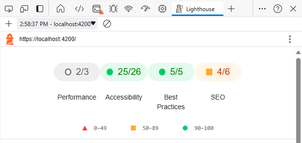
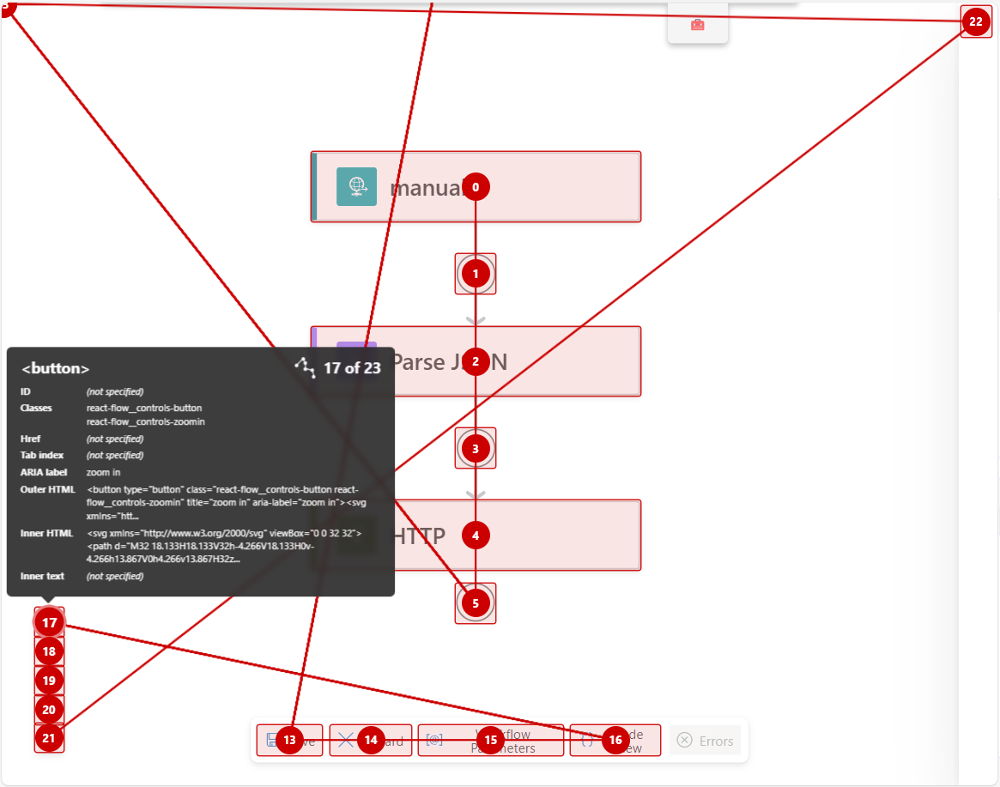

# Accessibility

### Common issues

- Improper tab navigation
- Unclear focus states
- Focus traps / losing focus
- Non-descriptive screen reader support

## Best Practices

### Tab navigation

- Users should be able to navigate your application and perform all necessary actions through tab navigation
  - Sub-items accessible by arrow keys
  - Items offscreen when tabbed to will move the window to bring it on-screen
- Should be ordered logically, with tabIndex if needed
  - Remove items with `tabIndex={-1}`
	- Add items with `tabIndex={0}`
	- Tab indexes above 0 can be used to manually order elements, but it's not recommended
- Use header tags for longer blocks of content (h1, h2, h3)
  - Some screen readers let users jump between sections based off the header tags
- Focus traps
  - Some components like rich text fields may "trap" focus, not allowing a tab press to advance focus
  - If you are creating a "focus trap" make sure the user is able to escape out to continue navigation
  - Also check when entering / exiting submenus

### Focus indication

- Every element that can receive focus should have an apparent visual indication of focus
  - Most of the time this is done just by a contrasting border / outline
  - Test your state colors with a tool like https://webaim.org/resources/contrastchecker/
  - WCAG focus guidelines https://www.w3.org/WAI/WCAG22/Understanding/focus-appearance.html

### Screen readers

- Users should be able to navigate your application with only the information read by screen readers
- Use proper html elements like `<button>`, `<ul>`, `<input>` when you can
	- Otherwise use the role property to categorize elements properly
	- https://developer.mozilla.org/en-US/docs/Web/Accessibility/ARIA/Roles
- Remember to translate all accessibility text
- Avoid using special characters, ex. "1 to 5" instead of "1-5"
- What screen readers verbalize
	- Normally screen readers will verbalize whatever the content of a focused item is
	- You can overwrite this with the ariaLabel prop, or the alt prop on img elements
	- There are plenty of other properties that get verbalized like ariaRequired
		- https://developer.mozilla.org/en-US/docs/Web/Accessibility/ARIA/Attributes
- Screen reader applications
	- JAWS - Windows application, widely used
		- https://support.freedomscientific.com/Downloads/JAWS
	- VoiceOver - Mac application
		- https://support.apple.com/guide/voiceover/welcome/mac
	- ChromeVox - Browser extension (usually not recommended)
		- https://chromewebstore.google.com/detail/screen-reader/kgejglhpjiefppelpmljglcjbhoiplfn

### Using prebuilt components

- If you use a prebuild / library component, don't assume that it will follow accessibility guidelines
  - Sometimes they just aren't compliant, or we use it in a way that messes with the accessibility
- Most fluent components are already compliant with WCAG guidelines

### Dialogues / Panels / Surfaces

- When new surfaces are rendered, be sure to test the focus and screen reader interactions
- Focus should be moved to the first element on the surface
- Screen readers should announce what happened when a surface opens / closes
	- ie. Announce that a dialogue opened, read the dialogue title, read the first element focused
- Decide on if the surface needs to trap focus, or if the user should be able to leave and access other elements

### Other tips

- Focus on conveying relevant information when writing components
	- There's no need to overload a component with 20 aria props
	- Most of the time just the content/label and the role is enough
- Remember to alert screen readers when new important information is available
	- ie. Dialogues opening, error messages
	- https://developer.mozilla.org/en-US/docs/Web/Accessibility/ARIA/Roles/alert_role

---

### Helpful tools

#### Browser devtools "Lighthouse"
Helpful way to analyze snapshots of your page

#### "taba11y" browser extension
Helpful to see tab flow all at once, also provides some info on other accessible properties easily
[Chrome webstore link](https://chromewebstore.google.com/detail/taba11y/aocppmckdocdjkphmofnklcjhdidgmga?hl=en)

---

### Other links

- [WCAG Standards](https://www.w3.org/WAI/standards-guidelines/wcag/)
- [MDN Accessibility](https://developer.mozilla.org/en-US/docs/Web/Accessibility)
- [CSUN Web Accessibility Criteria](https://www.csun.edu/universal-design-center/web-accessibility-criteria-0)
- [Microsoft Accessibility](https://www.microsoft.com/en-us/accessibility)
- [MS Accessibility sharepoint](https://microsoft.sharepoint.com/teams/accacademy?xsdata=MDV8MDJ8fDY3MDc2NDczNWQ4NzRmNzM5MTI5MDhkY2I3ZWM1ZjY5fDcyZjk4OGJmODZmMTQxYWY5MWFiMmQ3Y2QwMTFkYjQ3fDB8MHw2Mzg1ODc0NzMwMjA2ODY2MzN8VW5rbm93bnxWR1ZoYlhOVFpXTjFjbWwwZVZObGNuWnBZMlY4ZXlKV0lqb2lNQzR3TGpBd01EQWlMQ0pRSWpvaVYybHVNeklpTENKQlRpSTZJazkwYUdWeUlpd2lWMVFpT2pFeGZRPT18MXxMMk5vWVhSekx6RTVPbTFsWlhScGJtZGZUVVJCTkZwRVl6Uk9iVWwwVG1wSk1VMXBNREJQVjFacVRGZEthbGx0U1hSUFIwNW9Xa1JPYlZwVVNtMU9SMUpvUUhSb2NtVmhaQzUyTWk5dFpYTnpZV2RsY3k4eE56SXpNVFV3TlRBeE1EQXp8ODdjM2M2YjM2ZGE4NDk2ZDkxMjkwOGRjYjdlYzVmNjl8ZGQ5YmZkOWY3NjJiNDQ1YzljMjk3YTAyYzVjMzc2OGE%3d&sdata=clAyQjBsdDl3b0k1TTJEZjRqd3dkOC9FRURUQm9EaWNTNUpLbHE3Sy9yRT0%3d&ovuser=72f988bf-86f1-41af-91ab-2d7cd011db47%2crileyevans%40microsoft.com&OR=Teams-HL&CT=1723150545887&clickparams=eyJBcHBOYW1lIjoiVGVhbXMtRGVza3RvcCIsIkFwcFZlcnNpb24iOiI0OS8yNDA4MDIxMjAwMyIsIkhhc0ZlZGVyYXRlZFVzZXIiOmZhbHNlfQ%3d%3d&SafelinksUrl=https%3a%2f%2fmicrosoft.sharepoint.com%2fteams%2faccacademy)
- [MS - JAWS request](https://microsoft.service-now.com/sp?id=sc_cat_item&sys_id=084d5f85dbc82410b720f33768961956)
