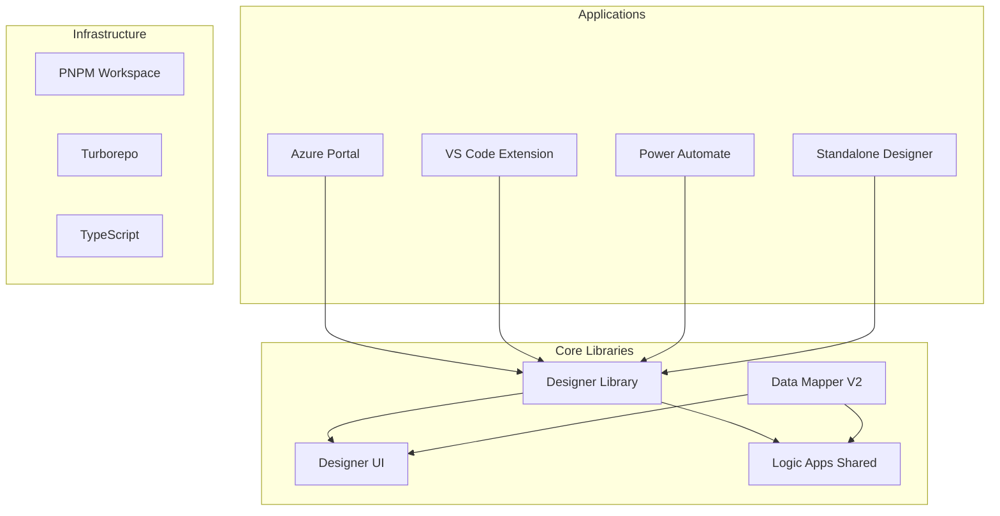
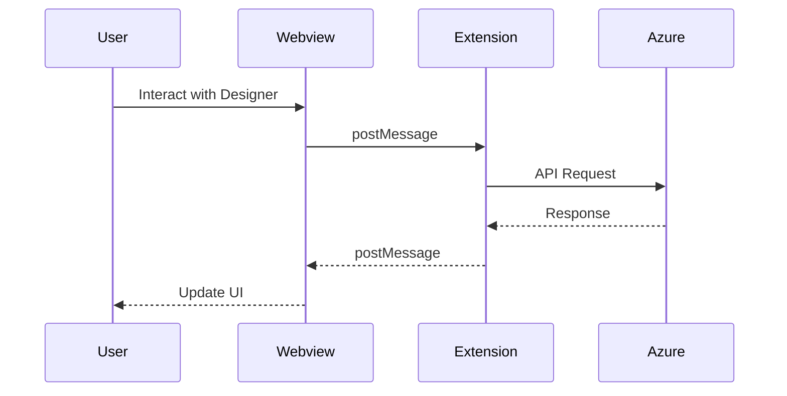

# Architecture Overview

This document provides a comprehensive overview of the Azure Logic Apps UX architecture, helping you understand how different components work together.

## High-Level Architecture

The Logic Apps UX is built as a **monorepo** using modern web technologies and follows a modular, component-based architecture.



## Technology Stack

### Core Technologies

- **TypeScript** - Type-safe development across all packages
- **React 18** - Component framework with hooks
- **Redux Toolkit** - State management with modern patterns
- **Fluent UI** - Microsoft's design system (v8 and v9)
- **Monaco Editor** - Code editing capabilities
- **React Flow (XY Flow)** - Workflow visualization

### Build & Development Tools

- **PNPM** - Fast, disk space efficient package manager
- **Turborepo** - High-performance build system with caching
- **Vite** - Lightning fast HMR for development
- **tsup** - Zero-config TypeScript bundler for libraries
- **Vitest** - Fast unit testing framework
- **Playwright** - Cross-browser E2E testing

## Package Architecture

### Applications (`/apps`)

#### Standalone Designer
- **Purpose**: Development and testing environment
- **Technology**: React + Vite
- **Features**:
  - Hot module replacement
  - Mock API for offline development
  - Template testing
  - Data Mapper integration

#### VS Code Extension
- **Structure**: Two packages working together
  - `vs-code-designer/` - Extension host code
  - `vs-code-react/` - Webview UI components
- **Communication**: Message passing between extension and webviews
- **Features**:
  - Local workflow authoring
  - Azure integration
  - Custom code support

#### Documentation Site
- **Technology**: Docusaurus
- **Purpose**: This documentation you're reading
- **Features**: MDX support, versioning, search

### Core Libraries (`/libs`)

#### Designer Library (`@microsoft/logic-apps-designer`)
The heart of the Logic Apps UX, providing:
- Workflow canvas with drag-and-drop
- Node-based workflow representation
- Operation configuration panels
- Expression editor
- Run history visualization

```typescript
// Example usage
import { DesignerProvider, Designer } from '@microsoft/logic-apps-designer';

<DesignerProvider options={designerOptions}>
  <Designer />
</DesignerProvider>
```

#### Data Mapper V2 (`@microsoft/logic-apps-data-mapper-v2`)
Visual data transformation tool:
- Schema-to-schema mapping
- Function-based transformations
- Loop and conditional mapping
- Real-time preview

#### Designer UI (`@microsoft/designer-ui`)
Shared UI components (stateless):
- Common controls
- Icons and assets
- Theme definitions
- Accessibility utilities

**Important**: This library must remain stateless - no Redux, no hooks with state.

#### Logic Apps Shared (`@microsoft/logic-apps-shared`)
Common utilities and services:
- API clients
- Data parsers
- Localization
- Type definitions

## State Management

### Redux Architecture

The application uses Redux Toolkit with a slice-based approach:

```typescript
// Store structure
{
  designer: {
    workflow: WorkflowState,
    operations: OperationsState,
    panel: PanelState,
    settings: SettingsState
  },
  dataMapper: {
    schemas: SchemaState,
    connections: ConnectionState,
    functions: FunctionState
  },
  app: {
    theme: ThemeState,
    locale: LocaleState
  }
}
```

### React Query Integration

Server state is managed with React Query:
- Caching and synchronization
- Background refetching
- Optimistic updates
- Request deduplication

## Communication Patterns

### VS Code Extension Architecture



### Message Types
```typescript
interface VsCodeMessage {
  command: string;
  data: any;
  requestId?: string;
}
```

## Styling and Theming

### Fluent UI Integration

We use both Fluent UI v8 and v9:
- **v8**: Legacy components, gradually migrating
- **v9**: New components, preferred for new features

### Theme Support

```typescript
// Theme structure
interface Theme {
  palette: ColorPalette;
  typography: Typography;
  spacing: SpacingTokens;
  effects: Effects;
}
```

Themes are provided via React Context and support:
- Light/Dark modes
- High contrast
- Custom brand themes

## Performance Considerations

### Build Optimization

1. **Turborepo Caching**: Builds are cached at package level
2. **Tree Shaking**: Unused code eliminated in production
3. **Code Splitting**: Dynamic imports for large features
4. **Lazy Loading**: Components loaded on demand

### Runtime Optimization

1. **React.memo**: Prevent unnecessary re-renders
2. **useMemo/useCallback**: Optimize expensive computations
3. **Virtualization**: Large lists rendered efficiently
4. **Web Workers**: Heavy computations off main thread

## Security

### Content Security Policy

Strict CSP headers in production:
```javascript
{
  "default-src": ["'self'"],
  "script-src": ["'self'", "'unsafe-eval'"], // Monaco requirement
  "style-src": ["'self'", "'unsafe-inline'"], // Fluent UI requirement
}
```

### Authentication

- Azure AD integration for portal/cloud scenarios
- Token management in VS Code extension
- No credentials in client-side code

## Deployment

### NPM Publishing

Libraries are published to NPM:
1. Version bump with `standard-version`
2. Build with `pnpm run build:lib`
3. Publish with `pnpm publish -r`

### VS Code Extension

1. Build with `pnpm run build:extension`
2. Package with `vsce package`
3. Publish to VS Code Marketplace

### Continuous Integration

- GitHub Actions for PR validation
- Azure Pipelines for release builds
- Automated testing on multiple browsers
- Code coverage requirements

## Best Practices

### Code Organization

1. **Feature-based structure** in applications
2. **Barrel exports** for clean imports
3. **Shared types** in dedicated packages
4. **Consistent naming** conventions

### Component Design

1. **Composition over inheritance**
2. **Props interfaces** for all components
3. **Storybook** for component documentation
4. **Accessibility** first approach

### State Management

1. **Normalize state** shape
2. **Selectors** for derived state
3. **Actions** for all state changes
4. **Immutable** updates only

## Further Reading

- [Development Workflow](./Development/workflow) - Day-to-day development practices
- [Testing Strategy](./Development/Testing) - Comprehensive testing guide
- [Contributing Guide](./contributing) - How to contribute
- [API Reference](./api-reference) - Detailed API documentation