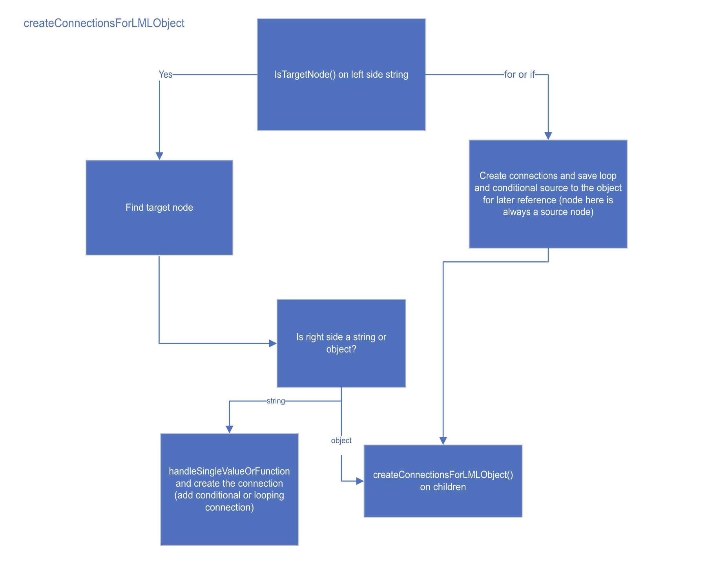

# Deserialization and LML

Deserialization refers to the process where we convert the LML file describing the mapping, to the connections used to display the visual map
## createConnectionsForLMLObject

Main entry function where we work through the LML

## Psuedofunctions and other special characters in LML

### Pseudofunctions:
 
To the user a pseudofunction looks like any other function- but in the LML we use special syntax

- [number]
    - Direct access function
    - 1 based and not 0 based
        - Ex: [1] would be the first element only
- $for
    - Indicates a loop
    - Occurs on left side of mapping
    - First argument is the source element of the loop- should be a repeating element
    - Can only be used once per line (not like other functions that can be nested)
    - Nested loops can have a relative path
    - Source elements inside of in a loop can be referenced with '.' notation
    - Index variable can be passed as a second argument
    - Does not create a function on the map- only a connection between source and target
- $if
    - Occurs on left side of mapping
    - Can only be used once per line (not like other functions that can be nested)
    - Only has one input (the boolean)
    - Can be connected to an object, and then the conditional will apply to all child elements below it
-'$' + variable
    - Index function
    - Indicated by '$' and an auto-generated variable
    - These variables are scoped, so you can have two '$a' in the same map
    - Index function on the map takes a repeating element as input

### Special Characters
- '../' and '.'
    - Used to reference relative position in looping
- '@' + value
    - Indicates an XML attribute as opposed to an element
    - In deserialization to the visual map, this is removed as it does not affect the visual map
- '$value'
    - When the parent type is something like 'string' but is also 'complex'
    - This to the parent
- '*'
    - Used in LML to indicate an 'ArrayItem' in a JSON schema, with 'for'
    - Needs to be inserted when serializing, but needs to be handled as a special case in deserializing
    - In the case of XSD to JSON, since the '*' is only on the source side, we may need to search for the 'ArrayItem' underneath the parent element

