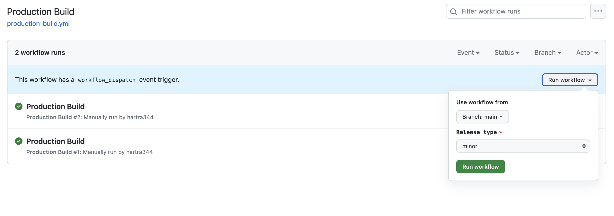
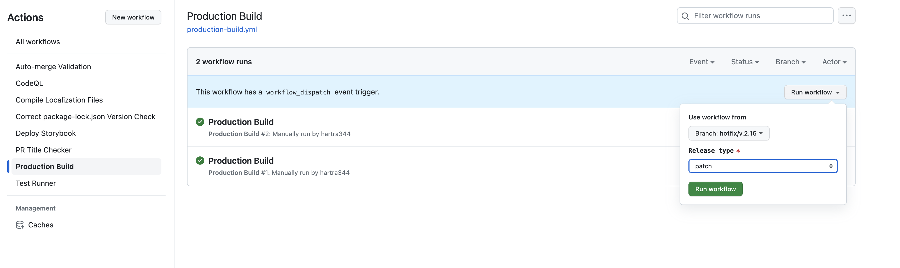

---
# Working with h2 to h5 Headings
toc_min_heading_level: 2
toc_max_heading_level: 5
---

# Generating A New Release

## Standard Release Procedure

:::caution

Please note, this documentation applies solely to version 2.16.0 and subsequent versions. It's incompatible with prior versions.

:::

### When to Initiate

A standard release procedure is initiated against the main branch, accomplishing several tasks:

1. It increments the Minor Version of the package (Major.Minor.Patch), while creating a tag on the git repository. This process also generates a change log detailing the variations from the previous release.
2. It creates NPM packages and forwards these packages to the production package repository.
3. It constructs both VSCode Extensions: Logic Apps Standard and Logic Apps Data Mapper.
4. It prepares a GitHub release inclusive of a change log and all artifacts intended for submission.

You should execute this procedure in preparation for a routine release cycle.

### Execution Steps

1. Navigate to https://github.com/Azure/LogicAppsUX/actions/workflows/production-build.yml.
2. Select 'Run Workflow', ensuring that the branch is set to 'main' and the release type is designated as 'Minor', as depicted below.
   
3. Initiate 'Run Workflow'.
4. Completion.

## Hotfix Release Procedure

### When to Initiate

A hotfix release procedure is initiated against a hotfix branch for a specific minor version. This is particularly handy when an immediate fix is required, but you prefer not to incorporate every change from the main branch.

This process will:

1. Increment the Patch Version of the package, specific to the minor version. For instance, executing the process on minor version 2.32.0 will yield 2.32.1. A subsequent hotfix would produce 2.32.2. This process remains exclusive to the hotfix branch.
2. Create NPM packages and dispatch them to the production package repository.
3. Construct both VSCode Extensions: Logic Apps Standard and Logic Apps Data Mapper.
4. Prepare a GitHub release inclusive of a change log and all necessary artifacts for submission.

### Execution Steps

:::note
The assumption here is that the necessary change has already been committed to the main branch. Only under rare circumstances should a change first be made in the hotfix branch.
:::

1. Begin with the repository on your local machine. Write permission is required on the main repository, and the normal fork process is insufficient.
2. [If the minor version hotfix branch already exists, proceed to step 4] In your terminal of choice, create a branch based on the tag of your version within the repository.
   Example command (replace 'version' with your version):

```
git checkout -b hotfix/v2.17 v2.17.0
```

:::note
The tag version that the branch is created from should always be patch version 0. To achieve anything higher than 0, the hotfix branch must have been previously created.
:::

3. Cherry pick the required change to your new branch, ensuring there are no merge conflicts.

```
git cherry-pick <commit-id>
```

4. Push the new branch to the main repository.

```
git push
```

5. Navigate to https://github.com/Azure/LogicAppsUX/actions/workflows/production-build.yml.

6. Select 'Run Workflow', ensuring that the branch is set to your hotfix branch and the release type is 'Patch', as shown below.
   
7. Initiate 'Run Workflow'.
8. Completion.
