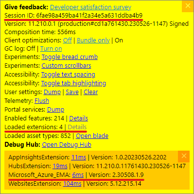

import Tabs from '@theme/Tabs';
import TabItem from '@theme/TabItem';
import React from 'react';

# Troubleshooting Guide

This comprehensive guide will help you diagnose and resolve issues with Logic Apps Designer. If you're experiencing any issues, we encourage you to report them to help us improve the product.

## Submitting an Issue

All of our issues are logged publicly over on our **[GitHub Issues](https://github.com/Azure/LogicAppsUX/issues)** page. Our development team checks these daily and will respond to them as soon as we are available.

Before you submit an issue, please check to see if there is already an issue open for your problem. If there is, please add a comment to the issue with any additional information you have. We also have a `Known Issues` section pinned at the top of our issues page for frequent issues.

[](https://github.com/Azure/LogicAppsUX/issues/2402)

[](https://github.com/Azure/LogicAppsUX/issues/2402)

If you determine your issue is unique, please **[submit a new issue](https://github.com/Azure/LogicAppsUX/issues/new?assignees=&labels=&projects=&template=bug_report.yml)** and start collecting the information requested in the issue template.

:::note Note on releases

We release new versions of Logic Apps Designer every 5 weeks. Depending on where we are in our current cycle when you submit your issue, it may take up to 5 weeks for us to release a fix for your issue after it is complete. We will do our best to mitigate your issue as soon as possible, and if the issue is severe enough we will potentially release a hotfix.

:::

### What Makes a Good Issue Report

<details>
<summary>**Essential Information Checklist**</summary>

When creating an issue, include:

- [ ] **Clear title**: Summarize the issue in 5-10 words
- [ ] **Environment details**: Browser, OS, region
- [ ] **Steps to reproduce**: Numbered list of exact steps
- [ ] **Expected vs actual behavior**: What should happen vs what happens
- [ ] **Error messages**: Exact text or screenshots
- [ ] **Workflow context**: Type (Consumption/Standard), size, complexity
- [ ] **Timeline**: When did the issue start?
- [ ] **Impact**: How many workflows/users affected?

</details>

### Providing Your Workflow

<Tabs>
<TabItem value="safe" label="Safe Sharing">

**Workflow Sanitizer Tool:**

Use this tool to automatically remove sensitive information from your workflow before sharing it in issue reports.

export const WorkflowSanitizer = () => {
  const [inputWorkflow, setInputWorkflow] = React.useState('');
  const [outputWorkflow, setOutputWorkflow] = React.useState('');
  const [error, setError] = React.useState('');
  const [copied, setCopied] = React.useState(false);

  const sanitizeWorkflow = (workflow) => {
    const sanitized = JSON.parse(JSON.stringify(workflow));
    
    // Remove connection details
    if (sanitized.parameters?.$connections) {
      Object.keys(sanitized.parameters.$connections.value).forEach(conn => {
        sanitized.parameters.$connections.value[conn] = {
          connectionId: "REDACTED",
          connectionName: conn,
          id: "REDACTED"
        };
      });
    }
    
    // Remove sensitive parameter values
    function sanitizeActions(actions) {
      Object.keys(actions).forEach(actionName => {
        const action = actions[actionName];
        
        // Redact API keys, passwords, secrets
        if (action.inputs) {
          const inputStr = JSON.stringify(action.inputs);
          const sanitizedStr = inputStr.replace(
            /"(api_key|apikey|password|secret|token|authorization|key|connectionString|accountKey|accessKey|clientSecret)":\s*"[^"]+"/gi,
            '"$1": "REDACTED"'
          );
          action.inputs = JSON.parse(sanitizedStr);
        }
        
        // Redact authentication headers
        if (action.inputs?.headers) {
          Object.keys(action.inputs.headers).forEach(header => {
            if (header.toLowerCase().includes('auth') || 
                header.toLowerCase().includes('key') ||
                header.toLowerCase().includes('token')) {
              action.inputs.headers[header] = "REDACTED";
            }
          });
        }
        
        // Recursively handle nested actions
        if (action.actions) {
          sanitizeActions(action.actions);
        }
      });
    }
    
    if (sanitized.definition?.actions) {
      sanitizeActions(sanitized.definition.actions);
    }
    
    if (sanitized.definition?.triggers) {
      sanitizeActions(sanitized.definition.triggers);
    }
    
    // Remove any workflow parameters that might contain secrets
    if (sanitized.definition?.parameters) {
      Object.keys(sanitized.definition.parameters).forEach(param => {
        if (param.toLowerCase().includes('secret') || 
            param.toLowerCase().includes('key') ||
            param.toLowerCase().includes('password')) {
          sanitized.definition.parameters[param].defaultValue = "REDACTED";
        }
      });
    }
    
    return sanitized;
  };

  const handleSanitize = () => {
    setError('');
    setCopied(false);
    
    try {
      const parsed = JSON.parse(inputWorkflow);
      const sanitized = sanitizeWorkflow(parsed);
      const output = JSON.stringify(sanitized, null, 2);
      setOutputWorkflow(output);
    } catch (e) {
      setError('Invalid JSON. Please paste a valid workflow definition.');
      setOutputWorkflow('');
    }
  };

  const handleCopy = async () => {
    try {
      await navigator.clipboard.writeText(outputWorkflow);
      setCopied(true);
      setTimeout(() => setCopied(false), 2000);
    } catch (e) {
      setError('Failed to copy to clipboard. Please select and copy manually.');
    }
  };

  return (
    <div style={{ marginTop: '20px' }}>
      <div style={{ marginBottom: '10px' }}>
        <label htmlFor="workflow-input" style={{ display: 'block', marginBottom: '5px', fontWeight: 'bold' }}>
          Paste your workflow JSON here:
        </label>
        <textarea
          id="workflow-input"
          value={inputWorkflow}
          onChange={(e) => setInputWorkflow(e.target.value)}
          placeholder="Paste your workflow definition JSON here..."
          style={{
            width: '100%',
            height: '200px',
            fontFamily: 'monospace',
            fontSize: '12px',
            padding: '10px',
            border: '1px solid #ccc',
            borderRadius: '4px',
            backgroundColor: 'var(--ifm-background-color)',
            color: 'var(--ifm-font-color-base)'
          }}
        />
      </div>
      
      <button
        onClick={handleSanitize}
        disabled={!inputWorkflow.trim()}
        style={{
          padding: '8px 16px',
          backgroundColor: inputWorkflow.trim() ? 'var(--ifm-color-primary-darker)' : 'var(--ifm-color-emphasis-300)',
          color: '#ffffff',
          border: 'none',
          borderRadius: '4px',
          cursor: inputWorkflow.trim() ? 'pointer' : 'not-allowed',
          marginBottom: '10px',
          fontWeight: '600'
        }}
      >
        Sanitize Workflow
      </button>
      
      {error && (
        <div style={{
          padding: '10px',
          backgroundColor: '#fee',
          border: '1px solid #fcc',
          borderRadius: '4px',
          marginBottom: '10px',
          color: '#c00'
        }}>
          {error}
        </div>
      )}
      
      {outputWorkflow && (
        <div style={{ marginTop: '20px' }}>
          <div style={{ display: 'flex', justifyContent: 'space-between', alignItems: 'center', marginBottom: '5px' }}>
            <label style={{ fontWeight: 'bold' }}>
              Sanitized workflow (safe to share):
            </label>
            <button
              onClick={handleCopy}
              style={{
                padding: '4px 12px',
                backgroundColor: 'var(--ifm-color-primary-darker)',
                color: '#ffffff',
                border: 'none',
                borderRadius: '4px',
                cursor: 'pointer',
                fontSize: '14px',
                fontWeight: '600'
              }}
            >
              {copied ? '✓ Copied!' : 'Copy to Clipboard'}
            </button>
          </div>
          <textarea
            value={outputWorkflow}
            readOnly
            style={{
              width: '100%',
              height: '300px',
              fontFamily: 'monospace',
              fontSize: '12px',
              padding: '10px',
              border: '1px solid #ccc',
              borderRadius: '4px',
              backgroundColor: 'var(--ifm-background-surface-color)',
              color: 'var(--ifm-font-color-base)'
            }}
          />
        </div>
      )}
    </div>
  );
};

<WorkflowSanitizer />

**What this tool removes:**
- Connection IDs and authentication details
- API keys, passwords, secrets, and tokens in action inputs
- Authorization headers
- Sensitive workflow parameters
- Any field names containing "secret", "key", "password", "token", etc.

**Manual verification:**
After sanitizing, please review the output to ensure no sensitive information remains. Look for:
- Email addresses
- Server names or IP addresses
- Database connection strings
- Any other organization-specific data

</TabItem>
<TabItem value="screenshot" label="Screenshots">

**Effective Screenshot Guidelines:**

1. **Highlight the Issue**:
   - Use arrows or boxes to point to problems
   - Include error messages in frame
   - Show relevant UI context

2. **Multiple Views**:
   - Designer view showing the action
   - Settings/parameters panel
   - Error notifications
   - Console errors (if applicable)

3. **Annotation Tips**:
   ```
   Windows: Win + Shift + S (Snip & Sketch)
   Mac: Cmd + Shift + 4 (Screenshot tool)
   Browser: Extensions like Awesome Screenshot
   ```

</TabItem>
</Tabs>

### Collecting Diagnostic Data

#### Console Errors - Detailed Guide

<details>
<summary>**Step-by-Step Console Error Collection**</summary>

1. **Open Developer Tools**:
   - `F12` or `Ctrl+Shift+I` (Win) / `Cmd+Opt+I` (Mac)
   - Right-click → "Inspect"

2. **Navigate to Console Tab**:
   - Look for red error messages
   - Yellow warnings may also be relevant

3. **Reproduce the Issue**:
   - Clear console first: `Ctrl+L` or click 🚫
   - Perform the action that causes the error
   - Errors will appear in real-time

4. **Capture Errors Effectively**:
   ```javascript
   // To save all errors to clipboard:
   copy(Array.from(document.querySelectorAll('.console-message-text')).map(e => e.textContent).join('\n'));
   
   // To get stack traces:
   console.save = function(data, filename){
     if(!data) {
       console.error('Console.save: No data');
       return;
     }
     if(typeof data === "object"){
       data = JSON.stringify(data, undefined, 4);
     }
     var blob = new Blob([data], {type: 'text/json'}),
         e = document.createEvent('MouseEvents'),
         a = document.createElement('a');
     a.download = filename;
     a.href = window.URL.createObjectURL(blob);
     a.dataset.downloadurl = ['text/json', a.download, a.href].join(':');
     e.initMouseEvent('click', true, false, window, 0, 0, 0, 0, 0, false, false, false, false, 0, null);
     a.dispatchEvent(e);
   }
   ```

5. **What to Look For**:
   | Error Type | Example | Likely Cause |
   |------------|---------|--------------|
   | TypeError | `Cannot read property 'x' of undefined` | Missing data/schema |
   | NetworkError | `Failed to fetch` | API/connectivity issue |
   | SyntaxError | `Unexpected token` | Invalid JSON/expression |
   | ReferenceError | `x is not defined` | Missing dependency |

</details>

#### Network Logs (HAR Files) - Advanced Collection

<details>
<summary>**Professional HAR File Collection**</summary>

**Pre-Collection Setup:**

1. **Prepare Browser**:
   ```
   1. Close unnecessary tabs (reduce noise)
   2. Clear cache: Ctrl+Shift+Delete
   3. Open incognito/private window (if possible)
   4. Disable unnecessary extensions
   ```

2. **Configure Network Tab**:
   ```
   1. Open DevTools → Network tab
   2. Enable: ☑ Preserve log
   3. Enable: ☑ Disable cache
   4. Clear existing logs: 🚫
   5. Optional: Set throttling to reproduce slow connections
   ```

3. **Collection Process**:
   ```
   1. Start with Network tab open BEFORE navigating
   2. Navigate to Logic App Designer
   3. Reproduce the exact issue
   4. Wait for all requests to complete
   5. Look for red (failed) requests
   ```

4. **Export and Sanitize**:
   ```
   1. Right-click in Network tab
   2. Select "Save all as HAR with content"
   3. Save with descriptive name: "issue-description-date.har"
   4. Sanitize at https://aka.ms/sanitizer
   5. Download sanitized version
   ```

**What Engineers Look For in HAR Files:**

- Request/response timing patterns
- Failed requests and error codes
- Authentication headers
- Payload sizes causing timeouts
- CORS or security policy violations
- Resource loading sequences

</details>

:::caution Sensitive Information Warning

HAR files contain:
- Authentication tokens
- Request/response bodies
- Cookies and session data
- Potentially sensitive URLs

**Always sanitize before sharing!** Use the [Microsoft HAR Sanitizer](https://aka.ms/sanitizer) or manually remove sensitive data.

:::

### Platform-Specific Information

#### Finding Session ID and Extension Version

<Tabs>
<TabItem value="portal" label="Azure Portal">

**Portal Diagnostics:**

1. **Open Diagnostic Tools**:
   - Windows: `Ctrl+Alt+D`
   - Mac: `Ctrl+Opt+D`
   - Alternative: `?` → "View diagnostics"

2. **Locate Information**:
   ```
   Session ID: xxxx-xxxx-xxxx-xxxx
   Build Number: 1.0.12345.6
   Extension: Microsoft_Azure_EMA: 2.145.0
   ```



</TabItem>
<TabItem value="vscode" label="VS Code">

**VS Code Diagnostics:**

1. **Extension Version**:
   ```
   1. Open Extensions panel: Ctrl+Shift+X
   2. Search "Logic Apps"
   3. Click on extension → version shown
   ```

2. **Collect Logs**:
   ```
   1. Open Output panel: View → Output
   2. Select "Azure Logic Apps" from dropdown
   3. Copy relevant error messages
   ```

3. **Developer Tools**:
   ```
   1. Help → Toggle Developer Tools
   2. Console tab for JavaScript errors
   3. Network tab for API issues
   ```

</TabItem>
</Tabs>

### Browser Information

<details>
<summary>**Quick Browser Version Check**</summary>

**All Browsers - Universal Method:**
```javascript
// Paste in console:
console.log(navigator.userAgent);
```

**Specific Browser Instructions:**

| Browser | Shortcut | Menu Path |
|---------|----------|-----------|
| **Edge** | `edge://version` | ⋯ → Help → About |
| **Chrome** | `chrome://version` | ⋮ → Help → About |
| **Firefox** | `about:support` | ☰ → Help → About |
| **Safari** | N/A | Safari → About Safari |

**Supported Versions:**
Any version of the browsers above that has been released in the last year. If your version is > 1 year old, then it will not be supported.

</details>

## Getting Additional Help

### Azure Support

For urgent production issues, consider Azure Support:

1. **Create Support Request**:
   - Portal: Help + Support → New support request
   - Severity levels:
     - A: Production down (1-hour response)
     - B: Production impaired (2-hour response)
     - C: Non-production (8-hour response)

2. **Information to Provide**:
   - Subscription ID
   - Resource ID of Logic App
   - Correlation ID from failed runs
   - Time range of issue
   - Business impact statement

3. **Support Resources**:
   - [Create Azure Support Request](https://docs.microsoft.com/azure/azure-portal/supportability/how-to-create-azure-support-request)
   - [Azure Status Page](https://status.azure.com)
   - [Service Health Dashboard](https://portal.azure.com/#blade/Microsoft_Azure_Health/AzureHealthBrowseBlade)

### Community Resources

- **[Stack Overflow](https://stackoverflow.com/questions/tagged/azure-logic-apps)**: Community Q&A
- **[Microsoft Q&A](https://docs.microsoft.com/answers/topics/azure-logic-apps.html)**: Official forum
- **[Logic Apps Blog](https://techcommunity.microsoft.com/t5/azure-logic-apps/bg-p/LogicAppsBlog)**: Latest updates
- **[GitHub Discussions](https://github.com/Azure/LogicAppsUX/discussions)**: Feature discussions
