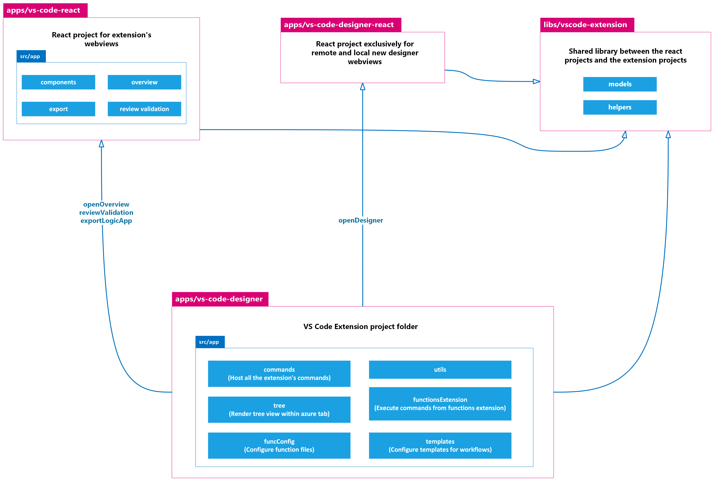

# Visual Studio Code Designer Extension

The Azure Logic Apps extension lets you quickly create, debug, manage, and deploy logic apps directly from Visual Studio Code.

## Prerequisites

- Follow the Prerequisites and Running the code instructions from the **Getting Started** section.

- Install [.NET 6.0 SDK](https://dotnet.microsoft.com/en-us/download/dotnet/6.0).
- Install the following Visual Studio Code extensions:
  - [Azure Tools](https://marketplace.visualstudio.com/items?itemName=ms-vscode.vscode-node-azure-pack)
  - [Azure Functions](https://marketplace.visualstudio.com/items?itemName=ms-azuretools.vscode-azurefunctions)

## Build/Compile

To build, run the following commands from the root of the repo folder:

```bash
npm run build:extension
```

## Run (Dev/Debug)

To run the Visual Studio Code extension in debug mode, follow these steps:

1.  In Visual Studio Code, open the repo folder.
2.  On the Activity bar to the left side, select **Run and Debug**. (Keyboard: Ctrl+Shift+D)
3.  From the drop-down list near the top, select **Run Designer Extension in Dev Mode**, then select **Start debugging**. This will build and run the extension. 

When the debugging session starts, a new Visual Studio Code workspace displays prompts for the running app. You can now add [breakpoints](https://code.visualstudio.com/docs/editor/debugging#_breakpoints) and debug the app using the [debug actions](https://code.visualstudio.com/docs/editor/debugging#_debug-actions).

To debug the app using the common browser's debugging console, for example, using `console.log()` or check the network calls, open the console by using the following keyboard shortcut: Ctrl+Shift+I.

For more information, see [debugging Visual Studio Code extensions](https://code.visualstudio.com/docs/editor/debugging).

## Build private vsix

To build a private vsix from the compiled project, follow these steps:

1.  Run the following command: `pnpm run vscode:designer:pack` in the root folder. This will compile the project and pack it in a vsix file.
2.  After running the command, you will see the following message: `Packaged: /<repo-path>/LogicAppsUX/apps/vs-code-designer/dist/vscode-azurelogicapps-<extension-version>.vsix` with the exact path where the vsix file is located.

## App architecture



### vs-code-designer

Host all the code needed to run the Visual Studio Code extension.

For more information, see [Extensions API](https://code.visualstudio.com/api) and [Extensions anatomy](https://code.visualstudio.com/api/get-started/extension-anatomy).

### vs-code-react

Host React project for remote and local designer webviews and the extension's webviews. Webviews are triggered by the `openDesigner`, `openOverview`, `exportLogicApp` and `reviewValidation` commands.

For more information, see [Visual Studio Code webviews](https://code.visualstudio.com/api/extension-guides/webview).

### vscode-extension

Host a shared library with helpers and models that are used across all the projects related to the Visual Studio Code extension.

To use the library, import `@microsoft/vscode-extension-logic-apps`.

## Key Insights

### package.json (apps/vs-code-designer/src/package.json)

The package.json file works as the project [manifest](https://code.visualstudio.com/api/references/extension-manifest). Therefore, review the following properties:

- [Activation Events](https://code.visualstudio.com/api/references/activation-events): States when to activate the extension. Make sure to set the command or any other event, if necessary.
- [Contribution Points](https://code.visualstudio.com/api/references/contribution-points): Helps implement the functionality in Visual Studio Code.
  - [Commands](https://code.visualstudio.com/api/references/contribution-points#contributes.commands): List of commands/functionalities in the extension. Consisting of a title, category, and enabled state. Enablement is expressed with [when clauses](https://code.visualstudio.com/api/references/when-clause-contexts).
  - [Menus](https://code.visualstudio.com/api/references/contribution-points#contributes.menus): Contains the command that should be invoked when selected and the condition under which the item should show.
  - [Configuration](https://code.visualstudio.com/api/references/contribution-points#contributes.configuration): Configuration options that are stated as user or workspace settings.
  - [Views](https://code.visualstudio.com/api/references/contribution-points#contributes.views): States the extension view container in the Azure activity bar.

For more information, see [creating new commands.](https://code.visualstudio.com/api/extension-guides/command#creating-new-commands).

### registerCommands.ts (apps/vs-code-designer/src/app/commands/registerCommands.ts)

The main function that helps bind a command ID to a handler function in the extension.
