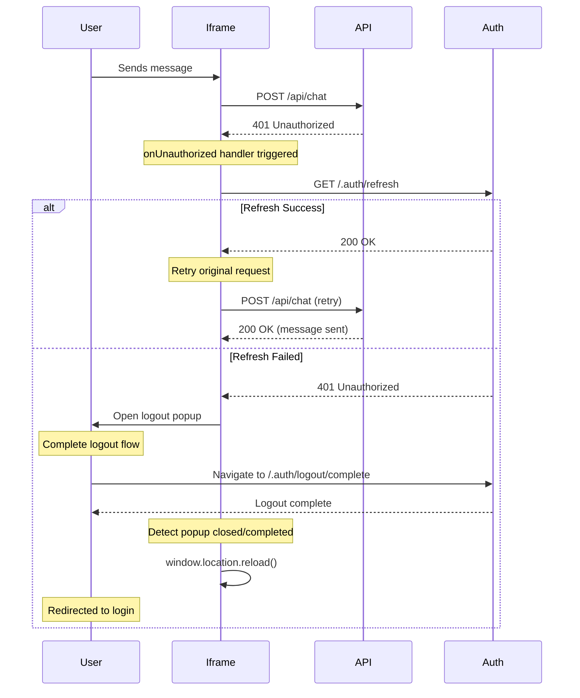

# A2A Chat Iframe App

Embeddable iframe widget for integrating A2A Chat into any web application without npm dependencies.

## Features

- 🖼️ **Easy embedding**: No npm, no build step - just add an iframe
- 💬 **Single & multi-session**: Support for single or multiple concurrent conversations
- 🎨 **Theme customization**: Preset themes or custom colors via URL parameters
- 🔒 **Secure communication**: Origin validation and cross-origin messaging
- 🪟 **Azure Portal ready**: Frame Blade protocol support for portal integration
- 🔐 **Authentication**: App Service EasyAuth with automatic token refresh
- 📨 **PostMessage API**: Dynamic configuration via parent-iframe communication
- 💾 **Server-side history**: Built-in support for persistent chat history
- 🏢 **Branding**: Logo placement and customization

## Quick Start

### Basic Embedding

```html
<!DOCTYPE html>
<html>
  <head>
    <title>My App with A2A Chat</title>
  </head>
  <body>
    <!-- Simple iframe integration -->
    <iframe
      src="https://your-domain.com/iframe.html?agentCard=https://api.example.com"
      width="400"
      height="600"
      style="border: none;"
    ></iframe>
  </body>
</html>
```

### With Configuration

```html
<!-- Via URL parameters -->
<iframe
  src="https://your-domain.com/iframe.html?agentCard=https://api.example.com&theme=blue&userName=John%20Doe&multiSession=false"
  width="400"
  height="600"
  style="border: none;"
></iframe>

<!-- Via data attributes -->
<iframe
  src="https://your-domain.com/iframe.html"
  data-agent-card="https://api.example.com"
  data-theme="blue"
  data-user-name="John Doe"
  data-welcome-message="Hello! How can I help?"
  data-multi-session="false"
  width="400"
  height="600"
  style="border: none;"
></iframe>
```

## Configuration Options

The iframe supports configuration via **URL parameters** or **data attributes**. Data attributes take priority over URL parameters.

### All Configuration Parameters

| Parameter/Attribute | Type    | Description                                   | Default   |
| ------------------- | ------- | --------------------------------------------- | --------- |
| `agentCard`         | string  | Agent card URL (required)                     | -         |
| `userId`            | string  | User identifier                               | -         |
| `userName`          | string  | Display name                                  | -         |
| `theme`             | string  | Preset theme (blue, green, red, purple, etc.) | 'default' |
| `mode`              | string  | Light or dark mode                            | 'light'   |
| `multiSession`      | boolean | Enable multi-session mode                     | false     |
| `singleSession`     | boolean | Force single-session mode                     | true      |
| `contextId`         | string  | Pre-populate session context ID               | -         |
| `allowFileUpload`   | boolean | Enable file uploads                           | true      |
| `maxFileSize`       | number  | Max file size in bytes                        | 10MB      |
| `allowedFileTypes`  | string  | Comma-separated MIME types                    | -         |
| `placeholder`       | string  | Input placeholder text                        | -         |
| `welcomeMessage`    | string  | Initial bot message                           | -         |
| `metadata`          | string  | JSON metadata object                          | -         |
| `apiKey`            | string  | API key for authentication                    | -         |
| `oboUserToken`      | string  | On-behalf-of user token                       | -         |
| `logoUrl`           | string  | Branding logo URL                             | -         |
| `logoSize`          | string  | Logo size (small, medium, large)              | 'medium'  |
| `logoPosition`      | string  | Logo position (header, footer)                | 'header'  |
| `expectPostMessage` | boolean | Wait for postMessage configuration            | false     |
| `inPortal`          | boolean | Azure Portal context mode                     | false     |
| `trustedAuthority`  | string  | Portal's origin for auth                      | -         |
| `allowedOrigins`    | string  | Comma-separated allowed postMessage origins   | -         |

### Preset Themes

Available preset themes:

- `default` - Default theme
- `blue` - Blue accent
- `green` - Green accent
- `red` - Red accent
- `purple` - Purple accent
- `teal` - Teal accent
- `orange` - Orange accent
- `pink` - Pink accent

### Custom Theme Colors

Override specific colors using data attributes:

```html
<iframe
  src="https://your-domain.com/iframe.html"
  data-agent-card="https://api.example.com"
  data-theme-primary="#0066cc"
  data-theme-background="#ffffff"
  data-logo-url="https://example.com/logo.png"
  width="400"
  height="600"
></iframe>
```

## Features

### Multi-Session Mode

Enable multiple concurrent conversations with a Discord/Teams-like sidebar:

```html
<iframe
  src="https://your-domain.com/iframe.html?agentCard=https://api.example.com&multiSession=true"
  width="600"
  height="700"
  style="border: none;"
></iframe>
```

**Features:**

- Multiple concurrent conversations
- Session persistence in localStorage
- Session renaming and deletion
- Last message preview
- Activity timestamps
- Sidebar toggle

### Server-Side History

Chat history is automatically stored server-side via the agent endpoint:

```typescript
// Configured automatically based on agent card URL
const storageConfig: StorageConfig = {
  type: 'server',
  agentUrl: agentCardUrl,
  getAuthToken: () => apiKey || oboUserToken || '',
};
```

### File Uploads

File upload support is enabled by default with configurable limits:

```html
<iframe
  src="https://your-domain.com/iframe.html?agentCard=https://api.example.com&allowFileUpload=true&maxFileSize=10485760&allowedFileTypes=image/*,application/pdf"
></iframe>
```

## PostMessage Protocol

The iframe supports dynamic configuration and bi-directional communication with the parent page via the PostMessage API.

### Basic Usage

```html
<iframe id="chat" src="https://your-domain.com/iframe.html?expectPostMessage=true"></iframe>

<script>
  const iframe = document.getElementById('chat');

  // Listen for iframe ready
  window.addEventListener('message', (event) => {
    // Verify origin for security
    if (event.origin !== 'https://your-domain.com') return;

    if (event.data?.type === 'IFRAME_READY') {
      // Iframe is loaded and ready for configuration
      console.log('Iframe ready');

      // Send configuration
      iframe.contentWindow.postMessage(
        {
          type: 'SET_AGENT_CARD',
          agentCard: {
            name: 'Support Bot',
            url: 'https://api.example.com/rpc',
            capabilities: { streaming: true },
          },
        },
        'https://your-domain.com'
      );
    }

    if (event.data?.type === 'AGENT_CARD_RECEIVED') {
      console.log('Configuration received by iframe');
    }
  });
</script>
```

### Message Types

#### Parent → Iframe

**SET_AGENT_CARD** - Send agent configuration:

```javascript
{
  type: 'SET_AGENT_CARD',
  agentCard: {
    name: string,
    url: string,
    description?: string,
    capabilities: { streaming: boolean, ... }
  }
}
```

#### Iframe → Parent

**IFRAME_READY** - Iframe initialization complete:

```javascript
{
  type: 'IFRAME_READY';
}
```

**AGENT_CARD_RECEIVED** - Configuration acknowledged:

```javascript
{
  type: 'AGENT_CARD_RECEIVED';
}
```

## Azure Portal Integration (Frame Blade)

The iframe supports the Azure Portal Frame Blade protocol for seamless portal integration.

### Basic Setup

```html
<iframe
  src="https://your-domain.com/iframe.html?inPortal=true&trustedAuthority=https://portal.azure.com"
  width="100%"
  height="100%"
></iframe>
```

### Frame Blade Messages

All messages use this format:

```typescript
{
  signature: 'FxFrameBlade',
  kind: string,
  data?: any,
  sessionId?: string
}
```

#### Iframe → Portal

- **ready** - Iframe initialized
- **initializationcomplete** - Setup finished
- **revealcontent** - Ready to display content

#### Portal → Iframe

- **themeChanged** - Theme update (`data: 'light' | 'dark'`)
- **authToken** - Authentication token (`data: token_string`)
- **chatHistory** - Import chat history

### Trusted Origins

The iframe validates portal messages from these origins:

- `df.onecloud.azure-test.net`
- `portal.azure.com`
- `ms.portal.azure.com`
- `rc.portal.azure.com`
- `localhost:55555` (development)

## Security

### Origin Validation

The iframe implements three-tier origin validation for postMessage:

1. **Explicit Configuration** (highest priority)
   - Via `allowedOrigins` URL parameter
   - Via `data-allowed-origins` attribute
   - Supports wildcard subdomains: `*.example.com`

2. **Default Allowed Origins** (medium priority)
   - Current iframe's own origin
   - Document referrer origin
   - Development origins (localhost)

3. **Wildcard Matching**
   - Patterns like `*.example.com` match all subdomains
   - Patterns like `https://*.azure.com` match all Azure subdomains

### Configuration Example

```html
<iframe
  src="https://your-domain.com/iframe.html?allowedOrigins=https://app.example.com,https://*.example.com,https://*.azure.com"
></iframe>
```

### CORS Requirements

For same-origin agent endpoints:

```
Access-Control-Allow-Origin: https://your-domain.com
Access-Control-Allow-Methods: GET, POST, OPTIONS
Access-Control-Allow-Headers: Content-Type, Authorization
Access-Control-Allow-Credentials: true
```

### Recommended Sandbox Attributes

```html
<iframe src="..." sandbox="allow-scripts allow-same-origin allow-forms allow-popups"></iframe>
```

## Authentication

### App Service EasyAuth

The iframe includes built-in support for Azure App Service EasyAuth with automatic token refresh.

**How it works:**

1. **401 Detection** - Detect unauthorized responses
2. **Token Refresh** - Automatically call `/.auth/refresh`
3. **Re-authentication** - Open popup if refresh fails
4. **Page Reload** - Force re-login after logout

**Example:**

```html
<iframe
  src="https://your-app.azurewebsites.net/chat/iframe?agentCard=https://your-app.azurewebsites.net/api/agents/bot"
></iframe>
```

### API Key Authentication

Pass API key via URL parameter:

```html
<iframe
  src="https://your-domain.com/iframe.html?agentCard=https://api.example.com&apiKey=your-api-key"
></iframe>
```

### On-Behalf-Of (OBO) Token

For user-context authentication:

```html
<iframe
  src="https://your-domain.com/iframe.html?agentCard=https://api.example.com&oboUserToken=user-token"
></iframe>
```

### Token via PostMessage (Azure Portal)

For portal integration, tokens are sent via postMessage:

```javascript
iframe.contentWindow.postMessage(
  {
    signature: 'FxFrameBlade',
    kind: 'authToken',
    data: 'bearer-token-here',
  },
  'https://portal.azure.com'
);
```

### Authentication Flow



## Deployment

### Build Process

```bash
# Install dependencies
pnpm install

# Build for production
pnpm build
```

**Output:**

- `dist/iframe.html` - Main entry point
- `dist/assets/` - JavaScript and CSS files with content hashes

### Hosting Options

#### 1. Static Hosting (Recommended)

Host the `dist` folder on any static server:

- **Azure Storage**: Static website hosting
- **AWS S3**: S3 bucket with static website hosting
- **Netlify/Vercel**: Deploy `dist` folder
- **GitHub Pages**: Commit `dist` to `gh-pages` branch
- **CDN**: CloudFlare, Fastly, or Azure CDN

#### 2. Azure App Service

Deploy to App Service with optional EasyAuth:

```bash
# Using Azure CLI
az webapp deployment source config-zip \
  --resource-group myResourceGroup \
  --name myAppService \
  --src dist.zip
```

#### 3. Docker Container

```dockerfile
FROM nginx:alpine
COPY dist /usr/share/nginx/html
EXPOSE 80
CMD ["nginx", "-g", "daemon off;"]
```

### URL Structure

The iframe can automatically detect agent card URLs from URL patterns:

**Standard Pattern:**

```
/api/agentsChat/{AgentKind}/IFrame
→ /api/agents/{AgentKind}/.well-known/agent-card.json
```

**Consumption Pattern:**

```
/scaleunits/{ScaleUnit}/flows/{FlowId}/agentChat/IFrame
→ Computed agent URL
```

### Content-Type Headers

Ensure your server serves proper Content-Type headers:

- `iframe.html` → `text/html`
- `*.js` → `application/javascript`
- `*.css` → `text/css`

### Cache Strategy

**Production:**

```
iframe.html → Cache-Control: no-cache
/assets/*.js → Cache-Control: public, max-age=31536000, immutable
/assets/*.css → Cache-Control: public, max-age=31536000, immutable
```

## Development

### Setup

```bash
# Install dependencies
pnpm install

# Start development server
pnpm dev

# Run in watch mode
pnpm dev --watch
```

### Testing

```bash
# Run tests
pnpm test

# Run tests in watch mode
pnpm test:watch

# Run tests with UI
pnpm test:ui

# Run tests with coverage
pnpm test:coverage
```

### Building

```bash
# Build for production
pnpm build

# Preview production build
pnpm preview
```

### Code Quality

```bash
# Type checking
pnpm typecheck

# Linting
pnpm lint

# Formatting
pnpm format
```

## Troubleshooting

### Iframe Not Loading

**Check:**

1. Agent card URL is correct and accessible
2. CORS headers are properly configured
3. Browser console for errors
4. Network tab for failed requests

**Solution:**

```javascript
// Debug mode - add to URL
?agentCard=https://api.example.com&debug=true
```

### PostMessage Not Working

**Check:**

1. Origin validation - allowed origins configured correctly
2. `expectPostMessage=true` in URL
3. Parent origin matches allowed list
4. Message format is correct

**Solution:**

```javascript
// Check console for origin validation warnings
// Add explicit allowed origins
?allowedOrigins=https://app.example.com
```

### Authentication Errors

**Popup Blocked:**

- Browser blocked logout popup
- Falls back to redirect automatically

**Token Refresh Fails:**

- Check `/.auth/refresh` endpoint
- Verify same-origin policy
- Check App Service EasyAuth configuration

**Cross-Origin Errors:**

- Ensure iframe domain matches API domain
- Check CORS headers on API
- Verify credentials: 'include' for cookies

### Session Not Persisting

**Check:**

1. localStorage is enabled in browser
2. `contextId` parameter is set if resuming
3. Server-side history endpoint is accessible
4. Authentication token is valid

**Solution:**

```javascript
// Force new session
?agentCard=https://api.example.com&contextId=

// Resume existing session
?agentCard=https://api.example.com&contextId=existing-context-123
```

### Theme Not Applied

**Check:**

1. Theme parameter spelling is correct
2. Custom color values are valid hex codes
3. CSS custom properties are supported
4. Dark mode preference is set correctly

**Solution:**

```html
<!-- Use preset theme -->
data-theme="blue"

<!-- Or custom colors -->
data-theme-primary="#0066cc" data-theme-background="#ffffff"
```

### Performance Issues

**Check:**

1. File upload size limits
2. Message history size
3. Network latency to agent endpoint
4. Browser memory usage

**Solution:**

```javascript
// Limit file size
?maxFileSize=5242880  // 5MB

// Reduce history load
// Server should paginate results
```

## Examples

### Basic Integration

```html
<!DOCTYPE html>
<html lang="en">
  <head>
    <meta charset="UTF-8" />
    <meta name="viewport" content="width=device-width, initial-scale=1.0" />
    <title>Chat Support</title>
    <style>
      body {
        margin: 0;
        padding: 0;
        font-family: sans-serif;
      }
      .chat-container {
        position: fixed;
        bottom: 20px;
        right: 20px;
        width: 400px;
        height: 600px;
        box-shadow: 0 4px 12px rgba(0, 0, 0, 0.15);
        border-radius: 8px;
        overflow: hidden;
      }
    </style>
  </head>
  <body>
    <h1>My Website</h1>
    <p>Content goes here...</p>

    <div class="chat-container">
      <iframe
        src="https://your-domain.com/iframe.html?agentCard=https://api.example.com&theme=blue&userName=Guest"
        width="100%"
        height="100%"
        style="border: none;"
      ></iframe>
    </div>
  </body>
</html>
```

### Dynamic Configuration

```html
<!DOCTYPE html>
<html lang="en">
  <head>
    <meta charset="UTF-8" />
    <title>Dynamic Chat</title>
  </head>
  <body>
    <iframe id="chat" src="https://your-domain.com/iframe.html?expectPostMessage=true"></iframe>

    <script>
      const iframe = document.getElementById('chat');
      const allowedOrigin = 'https://your-domain.com';

      window.addEventListener('message', (event) => {
        if (event.origin !== allowedOrigin) return;

        if (event.data?.type === 'IFRAME_READY') {
          // Get user info from your auth system
          const user = getCurrentUser();

          iframe.contentWindow.postMessage(
            {
              type: 'SET_AGENT_CARD',
              agentCard: {
                name: `${user.name}'s Assistant`,
                url: 'https://api.example.com/rpc',
                capabilities: { streaming: true },
              },
            },
            allowedOrigin
          );
        }
      });

      function getCurrentUser() {
        // Your auth logic here
        return { name: 'John Doe', id: '123' };
      }
    </script>
  </body>
</html>
```

### Multi-Session with History

```html
<iframe
  src="https://your-domain.com/iframe.html"
  data-agent-card="https://api.example.com"
  data-multi-session="true"
  data-user-name="John Doe"
  data-theme="blue"
  width="600"
  height="700"
  style="border: none;"
></iframe>
```

## Documentation

For more information, see:

- [Main README](../../README.md) - Overall project documentation
- [Core Package](../../packages/a2a-core/README.md) - Library API reference
- [Architecture Docs](../../docs/) - Technical architecture
- [OBO Authentication](../../docs/OBO_AUTHENTICATION.md) - Authentication guide
- [Multi-Session Feature](./docs/multi-session.md) - Multi-session documentation
- [Parent Blade Integration](./docs/parent-blade-integration.md) - Azure Portal integration

## License

MIT - see [LICENSE.md](../../LICENSE.md)
