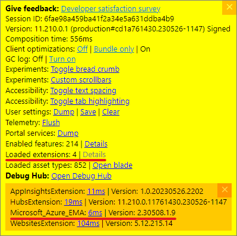

---
# Working with h2 to h5 Headings
toc_min_heading_level: 2
toc_max_heading_level: 5
---

# Trouble Shooting Guide

If you're experiencing any issues with Logic Apps Designer, please follow the steps below to help us investigate the issue as well as mitigate the issue for you.

## General mitigation steps

### Fallback to legacy designer

Our current main method of mitigation is to fall back to the now legacy version of Designer. This can be done by using the following URL to navigate to your Logic App. This will hopefully allow you to continue working while we investigate your issue.

**[Link to access legacy designer](https://aka.ms/lafallback)**

:::note

The fallback URL is not a permanent feature, and will be removed once we reach a point of higher stability.

:::

**If the issue persists even when using the legacy designer**, please make note of this when reporting the issue as it may be a backend issue that we will need to handle differently.

## Submitting an issue

All of our issues are logged publicly over on our **[GitHub Issues](https://github.com/Azure/LogicAppsUX/issues)** page. Our development team checks these daily and will respond to them as soon as we are available.

Before you submit an issue, please check to see if there is already an issue open for your problem. If there is, please add a comment to the issue with any additional information you have. We also have a `Known Issues` section pinned at the top of our issues page for frequent issues.

If you determine your issue is unique, please **[submit a new issue](https://github.com/Azure/LogicAppsUX/issues/new?assignees=&labels=&projects=&template=bug_report.yml)** and start collecting the information requested in the issue template.

:::note Note on releases

We release new versions of Logic Apps Designer every 2 weeks. Depending on where we are in our current cycle when you submit your issue, it may take up to 2 weeks for us to release a fix for your issue after it is complete. We will do our best to mitigate your issue as soon as possible, and if the issue is severe enough we will potentially release a hotfix.

:::

### Providing your workflow

If you are experiencing issues with a specific workflow, please provide the workflow definition if you are able. We understand that some workflows may contain sensitive information, so please remove any sensitive information before providing the workflow definition. If you are unable to provide the workflow definition, please provide a description or screenshots of the workflow and any important actions or connectors you think may be causing the issue.

### Collecting console errors

Providing console errors are very helpful for our engineers to quickly pinpoint the source of an issue. To collect console errors, please follow the steps below:

1. Open the developer tools in your browser with the keyboard shortcut `Ctrl+Shift+I (Win)` or `Cmd+Opt+I (Mac)`
2. Select the **Console** tab
3. If you see any errors, you can right-click on the error and select **Save as...** to save the error to a text file
4. Otherwise you can also copy/paste as needed

### Collecting network logs in a HAR file

If you are experiencing issues with the designer loading, or with any network requests, collecting a HAR file will help us investigate the issue. To collect a HAR file, please follow the steps below:

1. Open the developer tools in your browser with the keyboard shortcut `Ctrl+Shift+I (Win)` or `Cmd+Opt+I (Mac)`
2. Select the **Network** tab
3. Refresh the page and reproduce the issue
4. Once you have reproduced the issue, right-click anywhere in the grid of network requests, select **Save as HAR with Content**, and save the file to your computer
5. Your HAR file is now ready to be sent

:::caution Warning on sensitive information

These network logs may contain sensitive information, so please do not share them within GitHub issues. If an engineer requests them, please send them via email. (Should be supplied when requesting the HAR)

:::

### Finding your session ID or portal extension version

To get your session ID or currently active portal version follow these steps:

1. Navigate to a workflow
2. Open the Azure monitoring tools with `Ctrl+Alt+D (Win)` or `Ctrl+Opt+D (Mac)`
3. In the bottom right of the designer there should be a yellow box
4. You will find your **session ID** near the top of the list next to `Session ID:`
5. To get your **portal extension version** find the line `Loaded extensions: #` and click on `Details`
6. You will find your version next to the line that says `Microsoft_Azure_EMA:`

### Determining if issues are a Frontend or Backend issue

Some things that may indicate a backend issue are:

- Failed network requests in the browser developer tools
- Issue being reproducible between new and legacy designer

### Finding your browser version

#### Edge

1. Click the **three dots** in the top right corner of the browser
2. Select **Help and feedback** > **About Microsoft Edge**
3. Your version number will be displayed on the page that opens

#### Chrome

1. Click the **three dots** in the top right corner of the browser
2. Select **Help** > **About Google Chrome**
3. Your version number will be displayed on the page that opens

#### Firefox

1. Click the **three lines** in the top right corner of the browser
2. Select **Help** > **About Firefox**
3. Your version number will be displayed on the page that opens

#### Safari

1. Click the **Safari** menu in the top left corner of the screen
2. Select **About Safari**
3. Your version number will be displayed on the page that opens

## Azure support

If your issue is urgent you may want to consider bringing in Azure support as well and working with them directly. You can find more information on how to do this **[here](https://docs.microsoft.com/en-us/azure/azure-portal/supportability/how-to-create-azure-support-request)**.
