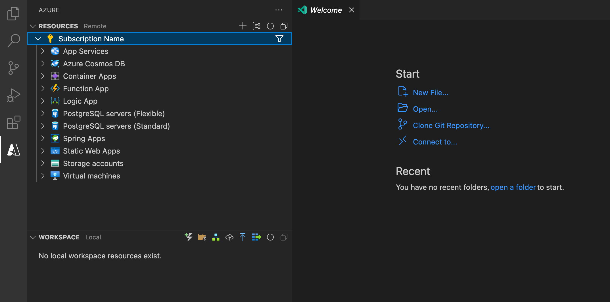

# Azure Logic Apps for Visual Studio Code (Standard)

In Visual Studio Code, you can use the Azure Logic Apps (Standard) extension to quickly create, debug, manage, and deploy logic apps directly to Azure. For requirements and more information, see [Create a Standard logic app workflow using Visual Studio Code](https://go.microsoft.com/fwlink/?linkid=2222287).

> Sign up today for your free Azure account and receive 12 months of free popular services, $200 free credit and 25+ always free services 👉 [Start Free](https://azure.microsoft.com/free/open-source).

## Logic apps (standard) to resources tab

🎉 Version 2.15.15 and bigger: Logic apps standard extension now follows the desing pattern that the rest of the azure extensions are following; this implies removing our extension tab and move the remote logic apps tree structure into the resources tab in the azure panel. You will be able to see your remote apps when opening the Logic App dropdown. This also applies to the ribbon buttons that we used to have in our tab title, those were migrated to the workspace tab.

## Known issues

You can see known issues [here](https://github.com/Azure/LogicAppsUX/issues).

## Providing feedback

- To open product bugs, go to [GitHub issues for Azure Logic Apps](https://github.com/Azure/LogicAppsUX/issues).

- To submit feedback and comments, use the [Azure Logic Apps feedback form](https://aka.ms/lafeedback).

### Code of Conduct

This project has adopted the [Microsoft Open Source Code of Conduct](https://opensource.microsoft.com/codeofconduct/). For more information see the [Code of Conduct FAQ](https://opensource.microsoft.com/codeofconduct/faq/) or contact [opencode@microsoft.com](mailto:opencode@microsoft.com) with any additional questions or comments.

## Telemetry

Visual Studio Code collects usage data and sends it to Microsoft to help improve our products and services. Read our [privacy statement](https://go.microsoft.com/fwlink/?LinkID=528096&clcid=0x409) to learn more. If you don’t wish to send usage data to Microsoft, you can set the `telemetry.enableTelemetry` setting to `false`. Learn more in our [FAQ](https://code.visualstudio.com/docs/supporting/faq#_how-to-disable-telemetry-reporting).

## License

[MICROSOFT SOFTWARE LICENSE TERMS](https://raw.githubusercontent.com/Azure/logicapps/master/preview/LICENSE)
