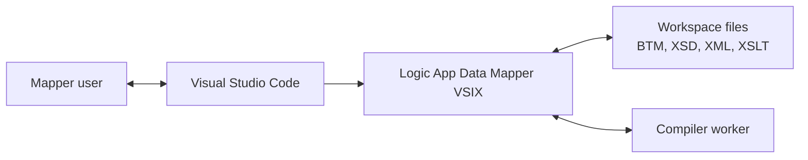
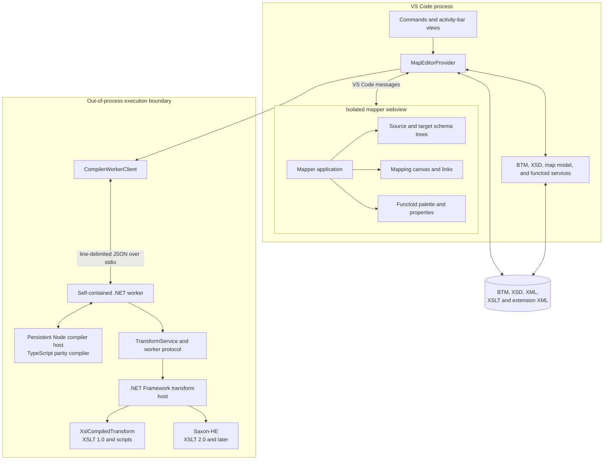
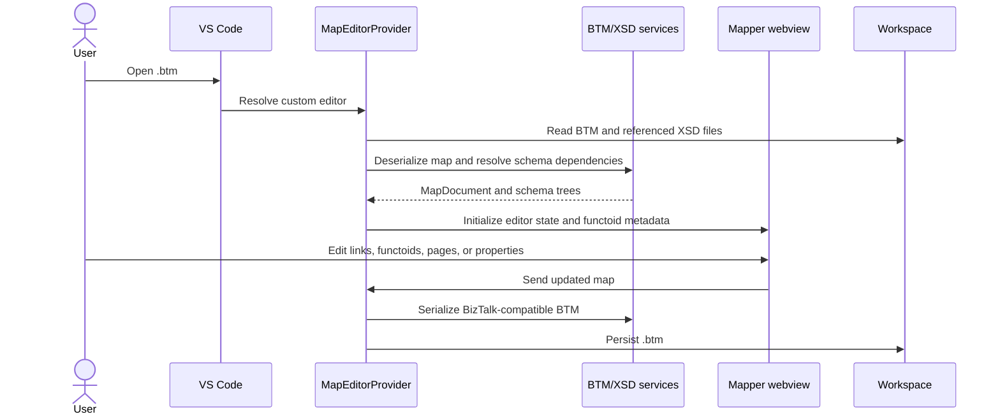
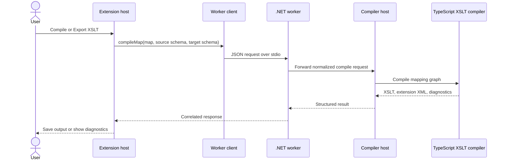
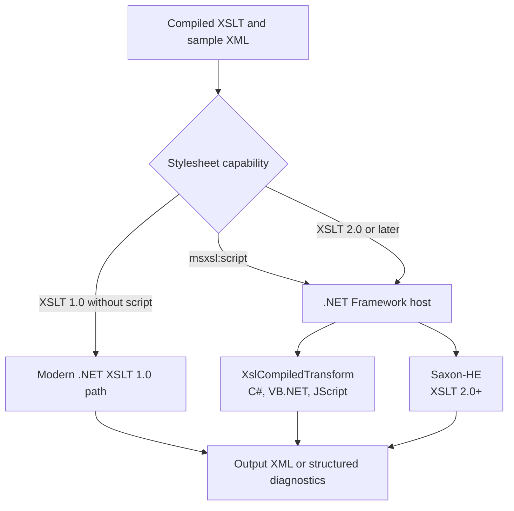
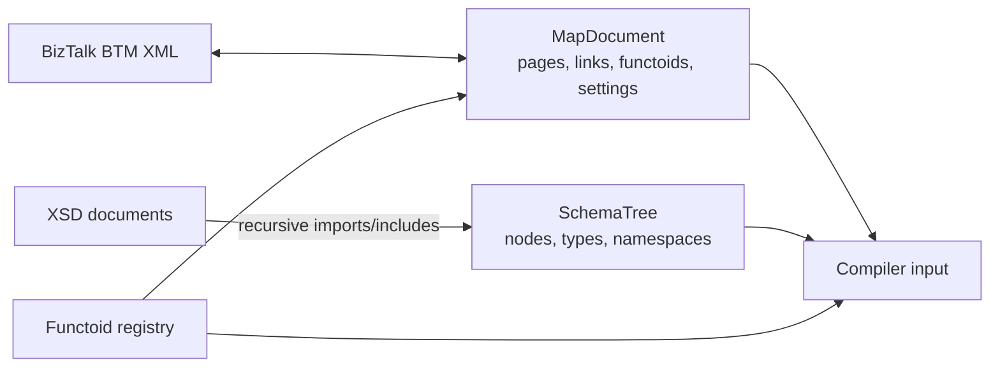
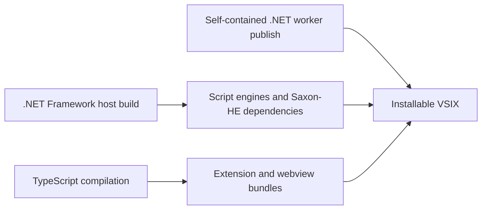

# Logic App Data Mapper for VS Code: High-Level Architecture

## Purpose

The Logic App Data Mapper VSIX is a standalone visual editor for creating,
editing, compiling, and testing BizTalk-compatible `.btm` maps. It separates
interactive editor work from compiler and transformation work so the VS Code
extension host remains responsive and failures are isolated in child
processes.

## System context

The VSIX requires VS Code and Windows. It does not require a BizTalk Server
installation or a separately installed modern .NET runtime.

## Component architecture

The webview uses React 18. `MapperApp` owns the React lifecycle and delegates
map-editing operations to `MapperAppController`. The schema trees, functoid
palette, and SVG mapping canvas are React components exposed through narrow
adapters so coordinate calculation and editor operations remain independently
testable. Host/webview communication uses the shared discriminated unions and
runtime guards in `src/protocol/mapEditorProtocol.ts`.

## Layer responsibilities

| Layer | Primary responsibility |
| --- | --- |
| VS Code integration | Activates the extension, registers commands and views, discovers maps, and hosts the custom `.btm` editor. |
| Webview designer | Renders schemas, pages, links, functoids, dialogs, and map editing interactions in an isolated browser context. |
| Editor services | Deserialize and serialize BTM XML, recursively resolve XSD imports/includes, build schema trees, maintain the map model, and provide functoid metadata. |
| Worker client | Lazily starts the worker, correlates requests and responses, enforces timeouts, reports structured failures, and restarts the worker on the request after a crash. |
| Compiler worker | Owns the stable process boundary for Compile Map and Test Map and manages the persistent compiler host. |
| Compiler host | Runs the parity-tested TypeScript map-to-XSLT compiler outside the VS Code extension host. |
| Transform runtimes | Execute XSLT 1.0, legacy C#/VB.NET/JScript script maps, or XSLT 2.0+ using the appropriate engine. |

## Primary flows

### Open, edit, and save

The webview owns transient interaction state. The extension host owns document
persistence and file access.

### Compile map

Compilation is out of process, but the authoritative compiler algorithm remains
TypeScript until its legacy-compatible passes are migrated and parity-tested in
C#.

### Test map

Microsoft script blocks and XSLT 2.0+ constructs cannot be combined in one
stylesheet because they require different processors. This combination fails
with an explicit diagnostic.

## Data model and compatibility

Compatibility is maintained at the persisted BTM/XSD boundary and at generated
XSLT behavior. The normalized in-memory model decouples the designer from raw
legacy XML while preserving legacy identifiers, schema roots, map settings,
functoid parameters, and link ordering.

The XSD projection resolves recursive imports/includes and QName-based element,
attribute, type, group, and attribute-group references. It retains sequence
order, simple and complex derivation, restrictions, substitution metadata,
wildcards, and list/union type metadata while guarding recursive definitions.

## Reliability boundaries

- The worker starts lazily and is reused across requests.
- Every request has an ID, timeout, structured success result, or structured
  error; protocol stdout is not used for logging.
- If the worker exits, pending operations fail explicitly and the next request
  starts and initializes a new worker. Interrupted operations are not
  automatically retried.
- The persistent compiler host is also isolated and recreated after failure.
- Modern-runtime external assemblies and generated C# script assemblies are
  loaded into a collectible `AssemblyLoadContext` for each transform. Private
  managed and native dependencies are resolved relative to the external
  assembly.
- Legacy script and Saxon transforms run in a short-lived .NET Framework child
  process, providing process-lifetime assembly isolation.
- External assemblies run outside the VS Code extension host, but these
  isolation boundaries are not security sandboxes.
- Map and schema files remain the source of truth; generated artifacts are
  written only through explicit commands.

## Packaging and deployment

The VSIX contains the bundled extension host, webview assets, compiler host,
self-contained `win-x64` worker, .NET Framework transform host, Saxon-HE
dependencies, and third-party notices.

## Related designs

- [`compiler-worker-design.md`](compiler-worker-design.md) describes the worker
  protocol, lifecycle, and compiler migration plan.
- [`functoid-properties-design.md`](functoid-properties-design.md) describes the
  functoid double-click properties experience.
