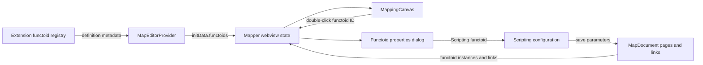
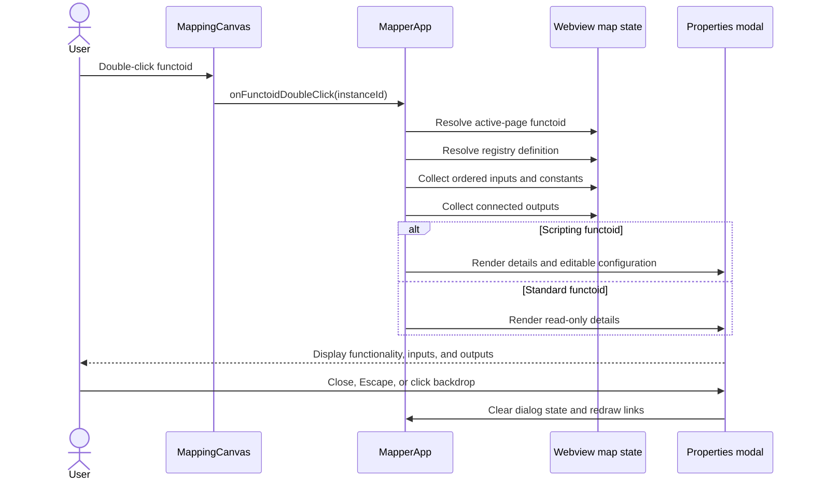
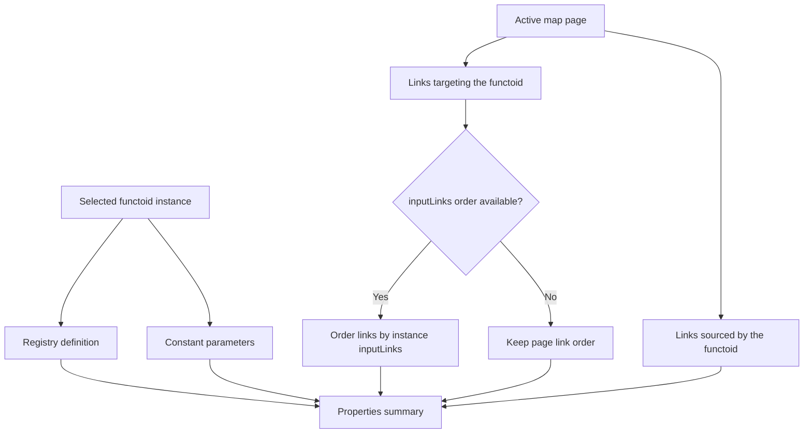

# Functoid Properties Design

## Purpose

The Functoid Properties experience explains what a functoid does and how it is
connected without requiring users to inspect the generated XSLT or BTM XML.
Double-clicking a functoid on the mapping canvas opens a modal that presents:

- functoid identity: name, category, and BizTalk functoid ID (FID);
- functionality description;
- expected input cardinality;
- configured link and constant inputs;
- output capability and connected targets; and
- scripting configuration for Scripting functoids.

## High-level architecture



The extension host sends immutable functoid-definition metadata when the editor
is initialized. The webview already owns the active map, page, functoid
instances, and links, so opening the dialog requires no extension-host or worker
round trip.

## Components

| Component | Responsibility |
| --- | --- |
| `FunctoidRegistry` | Supplies name, FID, category, description, input range, tooltip, and output capability. |
| `MapEditorProvider` | Projects registry definitions into the webview initialization payload. |
| `MappingCanvas` | Detects double-click and reports the functoid instance ID. |
| `MapperApp` | Resolves the instance, definition, input links, constants, and output links; owns dialog state. |
| Properties modal | Presents read-only functionality and connection details. |
| Scripting modal | Presents the same details plus editable script or external-assembly configuration. |

## Interaction flow



## Input and output resolution



Input links are displayed in `functoid.inputLinks` order when that metadata is
available. Each source is described as either a source-schema path or an
upstream functoid. Constant parameters are displayed with their parameter
index. Outputs are described as target-schema paths or downstream functoids.

An input range with a registry maximum of 100 is displayed as “N or more,”
matching the registry convention for variable-arity functoids.

## Dialog behavior

- Standard functoids open a read-only properties modal.
- Scripting functoids retain their editable script type, source, assembly,
  class, and method controls beneath the common properties summary.
- The selected functoid remains highlighted while the dialog is open.
- Escape, the Close/Cancel action, or clicking the modal backdrop closes it.
- All map-derived and registry-derived strings are HTML-escaped before they are
  inserted into modal markup.
- Saving a Scripting functoid updates the map through the existing webview map
  update path; viewing a standard functoid does not mutate the map.

## Data contract

The webview functoid-definition payload contains:

```text
id, name, category, description, tooltip,
minInputs, maxInputs, hasOutput
```

The properties view combines that definition with the active `MapFunctoid`,
its parameters, and the active page's `MapLink` collection. No new BTM fields,
worker protocol methods, or persisted settings are introduced.

## Extensibility

Future property editors can add functoid-specific sections while retaining the
common identity, functionality, input, and output summary. Custom functoid
providers only need to populate the existing definition metadata to receive the
standard properties experience.

